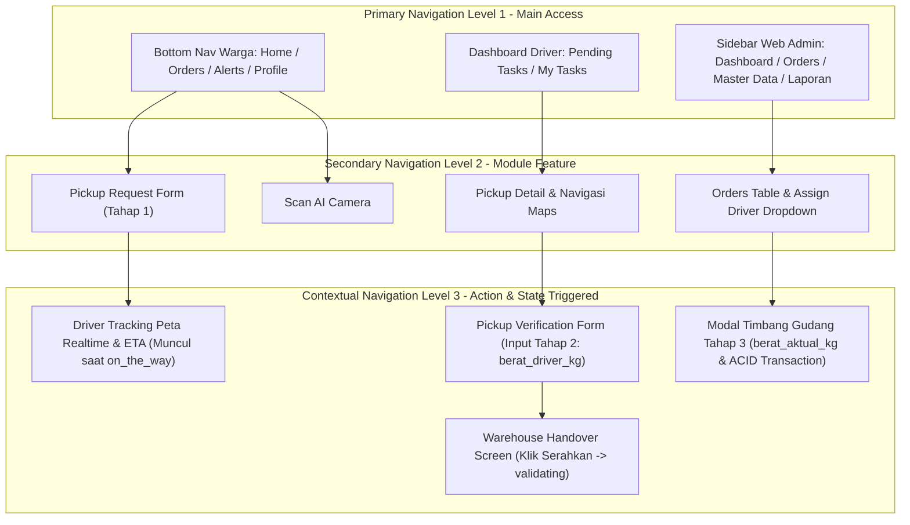

# INFORMATION ARCHITECTURE (IA) (*PHASE 3.5*)
**Sistem Informasi Bank Sampah Bersinar — Modul Penjemputan Sampah Berbasis Mobile**
*Struktur Organisasi Konten, Hierarki Navigasi, Taksonomi Domain, dan Relasi Informasi antar Peran*

---

## 1. EXECUTIVE SUMMARY (*Ringkasan Eksekutif*)

Dokumen **Information Architecture (`INFORMATION_ARCHITECTURE.md`)** ini merupakan kerangka kerja struktural (*Structural Blueprint*) yang mengorganisasikan, mengklasifikasikan, dan menyusun aliran seluruh informasi pada **Sistem Informasi Bank Sampah Bersinar**.

Fokus utama dari arsitektur informasi ini adalah membangun fondasi navigasi yang jelas dan logis untuk **Alur Penjemputan Sampah oleh Driver (*Online Pick-up Workflow*)** bagi 3 (tiga) peran aktor pengguna: **Warga**, **Driver**, dan **Petugas Bank Sampah (Web Admin)**.

Melalui perancangan Information Architecture (IA) yang matang, kita menjamin bahwa kompleksitas proses bisnis — seperti **Model Penimbangan 3 Tahap** (`estimasi_berat_kg`, `berat_driver_kg`, `berat_aktual_kg`) dan **6 Status Transisi Pesanan** (`pending` → `accepted` → `on_the_way` → `picked_up` → `validating` → `completed`) — disajikan kepada pengguna dalam struktur antarmuka yang sederhana, konsisten, dan mudah dipahami, tanpa risiko *information overload* atau kebingungan navigasi. Dokumen ini menjadi acuan mutlak sebelum melangkah ke tahap pembuatan *Sitemap*, *User Flow*, *Screen Specification*, *Wireframe*, dan *UI Design*.

---

## 2. PRINSIP INFORMATION ARCHITECTURE (*IA Design Principles*)

Perancangan arsitektur informasi ini dilandasi oleh 6 (enam) prinsip rekayasa perangkat lunak berstandar akademis dan industri:

1. **Simple (*Kesederhanaan Navigasi*)**: Setiap pengguna harus dapat menemukan informasi atau melakukan aksi utama dalam maksimal **3 kali interaksi/klik** dari halaman beranda (*Three-Click Rule*).
2. **Konsisten (*Konsistensi Penamaan & Istilah*)**: Penggunaan istilah berbahasa Indonesia akademis yang baku dan seragam di ketiga antarmuka (contoh: penggunaan istilah *"Jemputan"* untuk order pick-up, *"Timbang Awal"* untuk tahap 2, dan *"Timbang Final Gudang"* untuk tahap 3).
3. **Mudah Dipelajari (*Learnability & Cognitive Ease*)**: Penataan elemen visual mengikuti pola kebiasaan pengguna (*mental model*) mobile modern, di mana informasi paling penting selalu ditempatkan pada titik fokus utama (*Focal Point*).
4. **Mobile First (*Prioritas Antarmuka Bergerak*)**: Khusus untuk aplikasi Warga (`/Mobile`) dan Driver (`/Halaman-Driver`), struktur informasi dirancang efisien untuk layar vertikal (*portrait*) dengan navigasi sentuh satu tangan (*Thumb-Friendly Navigation*).
5. **Role-Based (*Pemisahan Konten Berbasis Peran*)**: Isolasi informasi yang ketat antar aktor; Warga hanya melihat informasi pengajuan dan saldo miliknya, Driver hanya melihat tugas operasional dan navigasi rute, sedangkan Web Admin memiliki otoritas penuh terhadap seluruh data transaksi.
6. **Scalability (*Kemampuan Berkembang*)**: Struktur pohon informasi dirancang modular sehingga penambahan fitur di masa depan (seperti modul setor langsung di kantor Bank Sampah atau e-wallet eksternal) dapat ditambahkan sebagai cabang baru tanpa merusak hierarki navigasi yang sudah ada.

---

## 3. HIERARKI INFORMASI (*Information Hierarchy Tree*)

Berikut adalah pemetaan hierarki informasi berurutan (*Hierarchical Tree Diagram*) dari level tertinggi (*Root*) hingga kedalaman fitur spesifik untuk masing-masing aktor:

### A. Hierarki Informasi Warga (`/Mobile` — Flutter)
```text
[Aplikasi Warga - Root / Main Navigation]
│
├── 1.0 HOME (Dasbor Utama)
│   ├── 1.1 Greeting & Profile Summary
│   ├── 1.2 Saldo Poin & Estimasi Nilai Rupiah
│   ├── 1.3 Carousel Banner Promo / Informasi
│   ├── 1.4 Menu Cepat (Quick Actions)
│   │   ├── 1.4.1 Buat Jemputan Baru
│   │   └── 1.4.2 Scan AI Deteksi Sampah
│   ├── 1.5 Tracking Card Ringkas (Active Order Status)
│   └── 1.6 Artikel Edukasi Ringkas
│
├── 2.0 PICKUP (Modul Penjemputan Sampah)
│   ├── 2.1 Buat Jemputan Baru (PickupRequestScreen - Tahap 1)
│   │   ├── 2.1.1 Pilihan & Koordinat Alamat Jemput
│   │   ├── 2.1.2 Pemilihan Tanggal & Sesi Waktu Jemput
│   │   ├── 2.1.3 Input Item Sampah & estimasi_berat_kg
│   │   └── 2.1.4 Kalkulator Estimasi Poin & Catatan Warga
│   ├── 2.2 Daftar Riwayat Jemputan (OrdersScreen)
│   │   ├── 2.2.1 Filter Tab: Semua / Berjalan / Selesai / Dibatalkan
│   │   └── 2.2.2 Kartu Order (Nomor ID, Alamat, Label 6 Status)
│   ├── 2.3 Detail Jemputan & Tracking (OrderDetailScreen)
│   │   ├── 2.3.1 Lini Masa 6 Status (pending → completed)
│   │   ├── 2.3.2 Informasi Kontak Armada Driver
│   │   └── 2.3.3 Tabel Audit Penimbangan 3 Tahap
│   └── 2.4 Tracking Peta Realtime (DriverTrackingScreen)
│       ├── 2.4.1 Peta Live Koordinat Driver & Rumah Warga
│       └── 2.4.2 Panel Perkiraan Waktu Tiba (ETA) & Jarak
│
├── 3.0 AI SCAN & EDUKASI (Modul Kecerdasan Buatan & Wawasan)
│   ├── 3.1 Kamera Deteksi AI (ScanScreen)
│   │   ├── 3.1.1 Viewfinder Kamera & Tombol Ambil Foto
│   │   └── 3.1.2 Hasil Klasifikasi Jenis & Panduan Pilah
│   └── 3.2 Katalog Edukasi Daur Ulang (EducationScreen)
│       ├── 3.2.1 Daftar Artikel & Tips Daur Ulang
│       └── 3.2.2 Detail Isi Artikel & Gambar
│
├── 4.0 REWARD & NOTIFICATION (Modul Pemberitahuan & Poin)
│   ├── 4.1 Daftar Notifikasi (AlertsScreen)
│   │   ├── 4.1.1 Filter: Semua / Belum Dibaca
│   │   └── 4.1.2 Pesan Transisi Status & Reward Poin Masuk
│   └── 4.2 Riwayat Poin (Reward Balance History)
│       └── 4.2.1 Daftar Pertambahan Poin Sah dari Gudang
│
└── 5.0 PROFILE (Pengaturan Akun)
    ├── 5.1 Informasi Akun (Nama, Telepon, Email, Alamat Default)
    ├── 5.2 Form Ubah Data Profil
    └── 5.3 Tombol Keluar (Logout)
```

---

### B. Hierarki Informasi Driver (`/Halaman-Driver` — Flutter)
```text
[Aplikasi Driver - Root / Dashboard]
│
├── 1.0 DASHBOARD (Dasbor Tugas Operasional)
│   ├── 1.1 Header Armada & Status Ketersediaan (Ready / Online)
│   ├── 1.2 Tab Tugas Pending (Daftar Jemputan Baru di Wilayah)
│   └── 1.3 Tab Tugas Saya / My Tasks (Daftar Tugas accepted / on_the_way)
│
├── 2.0 PICKUP EXECUTION (Eksekusi Penjemputan & Timbang Lapangan)
│   ├── 2.1 Detail Tugas Jemput (PickupDetailScreen)
│   │   ├── 2.1.1 Rincian Warga (Nama, Telepon, Tombol Telepon Langsung)
│   │   ├── 2.1.2 Peta Lokasi & Tombol Buka Navigasi (Google Maps)
│   │   ├── 2.1.3 Daftar Item Estimasi Warga (estimasi_berat_kg)
│   │   ├── 2.1.4 Aksi: Terima Tugas (status → accepted)
│   │   └── 2.1.5 Aksi: Mulai Menuju Lokasi (status → on_the_way)
│   ├── 2.2 Verifikasi Lapangan (PickupVerificationScreen - Tahap 2)
│   │   ├── 2.2.1 Form Input Berat Driver per Item (berat_driver_kg)
│   │   ├── 2.2.2 Unggah Foto Bukti Pengambilan & Catatan Lapangan
│   │   └── 2.2.3 Konfirmasi Angkut Sampah (status → picked_up)
│   └── 2.3 Serah Terima Gudang (WarehouseHandoverScreen)
│       ├── 2.3.1 Ringkasan Total Muatan yang Dibawa
│       ├── 2.3.2 Konfirmasi Penyerahan ke Petugas Gudang
│       └── 2.3.3 Tombol Serahkan Muatan (status → validating)
│
├── 3.0 SCHEDULE & HISTORY (Jadwal & Riwayat Tugas Armada)
│   ├── 3.1 Jadwal Jemput Mendatang (ScheduleScreen)
│   └── 3.2 Riwayat Tugas Selesai (HistoryScreen)
│       └── 3.2.1 Daftar Order Selesai beserta Catatan Timbang
│
└── 4.0 PROFILE & NOTIFICATION (Pengaturan Armada)
    ├── 4.1 Daftar Notifikasi Penugasan Baru (AlertsScreen)
    └── 4.2 Profil Armada & Spesifikasi Kendaraan (ProfileScreen)
```

---

### C. Hierarki Informasi Petugas Bank Sampah (Web Admin — `/bank_sampah`)
```text
[Portal Web Admin - Root / Front Controller]
│
├── 1.0 DASHBOARD (Dasbor Eksekutif & Statistik)
│   ├── 1.1 Metrik Utama: Total Warga, Total Driver, Order Aktif, Poin Terverifikasi
│   └── 1.2 Grafik Statistik Penjemputan & Tren Jenis Sampah
│
├── 2.0 ORDERS MANAGEMENT (Manajemen Penjemputan & Verifikasi)
│   ├── 2.1 Tabel Utama Jemputan (orders/data)
│   │   ├── 2.1.1 Filter 6 Status: pending / accepted / on_the_way / picked_up / validating / completed
│   │   ├── 2.1.2 Penugasan Manual Driver untuk Order pending (Assign Driver)
│   │   └── 2.1.3 Pemicu Modal Verifikasi untuk Order validating / picked_up
│   └── 2.2 Modal Verifikasi & Timbang Akhir Gudang (orders/verify_modal - Tahap 3)
│       ├── 2.2.1 Audit Perbandingan: estimasi_berat_kg vs berat_driver_kg
│       ├── 2.2.2 Input Berat Aktual Gudang per Item (berat_aktual_kg)
│       ├── 2.2.3 Kalkulator Poin Sah Otomatis (berat_aktual_kg * harga_poin)
│       ├── 2.2.4 Form Catatan Inspeksi & Potongan Kualitas Sampah
│       └── 2.2.5 Tombol Selesaikan Order & Salurkan Poin (Atomic ACID Transaction)
│
├── 3.0 MASTER DATA MANAGEMENT (Pengelolaan Katalog & Pengguna)
│   ├── 3.1 Katalog Jenis Sampah (jenis_sampah/data)
│   │   └── 3.1.1 CRUD Nama Sampah, Satuan, dan Harga Poin per KG
│   ├── 3.2 Data Warga Nasabah (warga/data)
│   │   └── 3.2.1 Daftar Nasabah, Riwayat Saldo Poin, dan Status Akun
│   ├── 3.3 Data Armada Driver (driver/data)
│   │   └── 3.3.1 Daftar Driver, Kontak, Kapasitas & Plat Nomor Kendaraan
│   └── 3.4 Data Artikel Edukasi (edukasi/data)
│       └── 3.4.1 CRUD Konten Panduan Daur Ulang
│
└── 4.0 REPORTING & SETTING (Laporan Operasional & Konfigurasi)
    ├── 4.1 Rekapitulasi Laporan (laporan/data)
    │   ├── 4.1.1 Filter Rentang Tanggal & Jenis Sampah
    │   └── 4.1.2 Cetak Laporan PDF / Excel untuk Administrasi TA
    └── 4.2 Profil Petugas & Logout
```

---

## 4. TAXONOMY (*Taksonomi Domain Fitur*)

Untuk menjamin pengelompokan yang kohesif (*High Cohesion*), seluruh fitur aplikasi diklasifikasikan ke dalam 6 (enam) domain taksonomi spesifik:

| Domain Taksonomi | Ruang Lingkup Informasi | Entitas Utama | Aktor Berwenang |
| :--- | :--- | :--- | :--- |
| **Domain Autentikasi & Identitas (`Identity Domain`)** | Pengamanan sesi login, pendaftaran akun, pengelolaan profil data diri, dan token API (`api_token`). | `Pengguna`, `Token Sesi` | Warga, Driver, Web Admin |
| **Domain Operasional Penjemputan (`Pick-up Core Domain`)** | Pembuatan order, pemilihan jadwal, penjadwalan armada, tracking koordinat peta, dan transisi 6 status perjalanan. | `Orders`, `Lokasi Peta`, `Timeline Tracking` | Warga, Driver, Web Admin |
| **Domain Audit & Penimbangan (`Weighing Domain`)** | Pencatatan angka berat secara ketat melalui 3 tahap penimbangan (`estimasi_berat_kg`, `berat_driver_kg`, `berat_aktual_kg`). | `Order Items`, `Katalog Jenis Sampah` | Warga (Input Tahap 1), Driver (Input Tahap 2), Web Admin (Input Tahap 3) |
| **Domain Reward & Poin (`Balance Domain`)** | Kalkulasi poin dari berat sah final, transaksi penambahan saldo secara *atomic*, dan histori saldo nasabah. | `Saldo Poin`, `Transaksi Saldo` | Warga (Menerima/Lihat), Web Admin (Menyalurkan via Sistem) |
| **Domain Kecerdasan Buatan & Edukasi (`AI & Edu Domain`)** | Klasifikasi gambar sampah berbasis model machine learning dan penyebaran informasi daur ulang. | `Deteksi AI`, `Artikel Edukasi`| Warga, Web Admin (Pengelola Konten) |
| **Domain Administrasi & Laporan (`Admin Reporting Domain`)** | Rekapitulasi statistik eksekutif, pencetakan dokumen pertanggungjawaban operasional bulanan/harian. | `Laporan PDF/Excel`, `Dasbor Statistik` | Web Admin |

---

## 5. NAVIGATION HIERARCHY (*Hierarki Tingkatan Navigasi*)

Arsitektur informasi ini membagi struktur navigasi ke dalam 3 (tiga) tingkatan kedalaman untuk mencegah pengguna tersesat (*Navigation Disorientation*):



1. **Primary Navigation (Navigasi Utama — Level 1)**:
   Gerbang utama aplikasi yang selalu bersemayam di layar (*Persistent Navigation*).
   - Pada aplikasi **Warga**: Bilah navigasi bawah (*Bottom Navigation Bar*) dengan 4 ikon utama (`Home`, `Orders`, `Alerts`, `Profile`).
   - Pada aplikasi **Driver**: Bilah tab atas pada layar dasbor (`Pending Tasks` vs `My Tasks`).
   - Pada **Web Admin**: Menu bilah sisi kiri (*Sidebar Navigation*) yang mengelompokkan modul operasional dan master data.
2. **Secondary Navigation (Navigasi Sekunder — Level 2)**:
   Layar fungsional yang dibuka saat pengguna memilih fitur pada navigasi utama.
   - Contoh: Layar formulir pembuatan order jemputan (`PickupRequestScreen`), layar daftar detail pesanan (`OrderDetailScreen`), atau halaman manajemen tabel order (`orders/data`).
3. **Contextual Navigation (Navigasi Kontekstual — Level 3)**:
   Navigasi spesifik yang **hanya muncul atau aktif ketika kondisi status tertentu terpenuhi (*State-Triggered*)**.
   - **Konteks `on_the_way`**: Memunculkan tombol dan layar navigasi *Peta Tracking Realtime & ETA* (`DriverTrackingScreen`) bagi warga.
   - **Konteks `picked_up`**: Memunculkan tombol dan layar *Serah Terima Gudang* (`WarehouseHandoverScreen`) bagi driver.
   - **Konteks `validating`**: Memunculkan tombol hijau *Validasi Timbang Akhir* dan *Modal Timbang Gudang (`verify_modal`)* bagi petugas Web Admin.

---

## 6. INFORMATION PRIORITY (*Prioritas Konten per Halaman*)

Untuk memastikan antarmuka mudah dipelajari (*Learnable*), elemen informasi pada setiap halaman kunci diurutkan berdasarkan tingkat kepentingan visual (*Focal Point Ranking*):

### A. Prioritas Informasi `HomeScreen` Warga
1. **Focal Point 1 (Top Priority)**: **Kartu Saldo Poin Reward & Nilai Konversi**. Ini adalah alasan utama warga menggunakan aplikasi Bank Sampah (transparansi insentif).
2. **Focal Point 2**: **Tracking Card Ringkas (*Active Order Alert*)**. Jika ada pesanan sedang berjalan (`on_the_way` / `validating`), kartu ini wajib menempati posisi teratas di bawah saldo poin.
3. **Focal Point 3**: **Tombol Aksi Cepat (*Buat Jemputan* & *Scan AI*)**.
4. **Pendukung (*Supporting Info*)**: Banner Promo & Artikel Edukasi terbaru di bagian bawah layar.

### B. Prioritas Informasi `OrderDetailScreen` Warga
1. **Focal Point 1 (Top Priority)**: **Lini Masa Tracking 6 Status (*Status Banner & Stepper*)**. Memberikan kepastian posisi muatan sampah saat ini.
2. **Focal Point 2**: **Tombol Aksi Kontekstual (*Lihat Peta Realtime* atau *Hubungi Driver*)**.
3. **Focal Point 3**: **Tabel Audit Perbandingan 3 Tahap Berat Muatan** (`estimasi_berat_kg` vs `berat_driver_kg` vs `berat_aktual_kg`).
4. **Pendukung**: Rincian alamat jemput, nomor ID pesanan, dan tanggal pengajuan.

### C. Prioritas Informasi `PickupVerificationScreen` Driver (Tahap 2)
1. **Focal Point 1 (Top Priority)**: **Form Input Berat Driver (`berat_driver_kg`) per Item Sampah**. Merupakan tugas utama driver di lapangan.
2. **Focal Point 2**: **Tombol Kamera Pengambilan Foto Bukti Lapangan**.
3. **Focal Point 3**: **Tombol Konfirmasi Angkut Sampah (`picked_up`)** berukuran besar dan fixed di bagian bawah layar.
4. **Pendukung**: Teks perbandingan angka `estimasi_berat_kg` milik warga sebagai acuan perbandingan awal.

### D. Prioritas Informasi Modal `orders/verify_modal` Web Admin (Tahap 3)
1. **Focal Point 1 (Top Priority)**: **Form Input Berat Aktual Gudang (`berat_aktual_kg`) per Item Sampah**. Menjadi **acuan mutlak (*Final Authority*)** penentuan poin.
2. **Focal Point 2**: **Kalkulator Poin Sah Otomatis (*Real-time Total Points Display*)**. Petugas melihat langsung angka poin yang akan dikirim sebelum konfirmasi.
3. **Focal Point 3**: **Tombol Eksekusi Transaksi Atomic ("Selesaikan Order & Salurkan Poin")**.
4. **Pendukung**: Tabel perbandingan riwayat berat tahap 1 (`estimasi_berat_kg`) dan tahap 2 (`berat_driver_kg`).

---

## 7. RELATIONSHIP MAPPING (*Pemetaan Relasi & Aliran Informasi Antar Halaman*)

Aliran informasi dalam sistem ini bersifat **berkesinambungan dan saling memperkaya (*Cumulative Information Enrichment*)**. Informasi yang diinput pada satu layar akan menjadi masukan wajib bagi layar di tahap berikutnya:

```text
[PickupRequestScreen - Warga]
Input: Alamat, Jadwal, Item Sampah, estimasi_berat_kg (Tahap 1)
                    │
                    ↓ (Mengalir melalui API POST orders_api.php)
[DashboardScreen & PickupDetailScreen - Driver]
Menampilkan: Alamat, Peta Warga, dan estimasi_berat_kg sebagai acuan awal
                    │
                    ↓ (Driver tiba di lokasi & melakukan penimbangan lapangan)
[PickupVerificationScreen - Driver]
Input: berat_driver_kg (Tahap 2) & Foto Bukti Pengambilan
                    │
                    ↓ (Mengalir melalui API PUT orders_api.php → status: picked_up / validating)
[orders/data & orders/verify_modal - Web Admin]
Menampilkan: Audit sanding estimasi_berat_kg VS berat_driver_kg
Input: berat_aktual_kg (Tahap 3 - Final Authority) & Kalkulasi Poin Sah
                    │
                    ↓ (Eksekusi Atomic ACID Transaction → status: completed)
[HomeScreen & OrdersScreen - Warga]
Menampilkan: Saldo Poin yang bertambah sah & Label Selesai pada Riwayat
```

---

## 8. CONTENT DEPENDENCY (*Rantai Ketergantungan Data*)

Setiap halaman fungsional tidak berdiri sendiri, melainkan memiliki ketergantungan ketat terhadap ketersediaan data dari halaman/modul lain:

1. **Ketergantungan Halaman `DriverTrackingScreen` (Warga)**:
   - **Data Dibutuhkan**: Koordinat `latitude` dan `longitude` armada secara *real-time*.
   - **Sumber Ketergantungan**: Halaman ini **100% bergantung** pada fungsi pengiriman koordinat latar belakang (*Background Location Sharing*) yang diaktifkan oleh `PickupDetailScreen` saat driver menekan tombol *Mulai Menuju Lokasi (`on_the_way`)*. Jika driver belum memilih status `on_the_way`, halaman peta tidak dapat ditampilkan.
2. **Ketergantungan Modal Verifikasi `orders/verify_modal` (Web Admin)**:
   - **Data Dibutuhkan**: Nilai `berat_driver_kg` dari lapangan serta daftar harga tukar poin `harga_poin_per_kg` dari tabel `jenis_sampah`.
   - **Sumber Ketergantungan**: Bergantung penuh pada kelengkapan pengisian `PickupVerificationScreen` oleh driver serta validitas katalog di modul `jenis_sampah/data`.
3. **Ketergantungan Kartu Tracking Ringkas di `HomeScreen` (Warga)**:
   - **Data Dibutuhkan**: Status order aktif terkini (`active_order_status`).
   - **Sumber Ketergantungan**: Bergantung pada transisi status yang dilakukan oleh Driver (`accepted`, `on_the_way`, `picked_up`) atau Petugas Gudang (`validating`).

---

## 9. BUSINESS RULES IA (*Aturan Bisnis Arsitektur Informasi*)

Untuk menjamin keabsahan logika sistem Tugas Akhir, penataan dan akses informasi pada setiap layar tunduk pada 3 (tiga) aturan bisnis mutlak:

### 1. Aturan Mutlak Transisi 6 Status (*Strict 6-Stage Status Progression*)
Informasi status pada seluruh layar **wajib mengikuti urutan transisi beruntun** dan tidak boleh dilompati:
$$\text{pending} \longrightarrow \text{accepted} \longrightarrow \text{on\_the\_way} \longrightarrow \text{picked\_up} \longrightarrow \text{validating} \longrightarrow \text{completed}$$
- *Pengecualian Pembatalan (`cancelled`)*: Pesanan hanya boleh dibatalkan (`cancelled`) oleh warga atau admin ketika status masih berada pada tahap `pending` atau `accepted`. Setelah armada driver berstatus `on_the_way` atau `picked_up`, pembatalan secara mandiri oleh warga dilarang oleh sistem.

### 2. Aturan Mutlak Model Penimbangan 3 Tahap (*Strict 3-Tier Weighing Authority*)
Arsitektur informasi membedakan secara tegas otoritas dan dampak keuangan dari masing-masing tahap penimbangan muatan:
- **Tahap 1 — Estimasi Warga (`estimasi_berat_kg`)**: Diinput di layar `PickupRequestScreen`. **Hanya bersifat informasi perkiraan**. Poin estimasi yang muncul **DILARANG KERAS** ditambahkan ke saldo database `pengguna.saldo`.
- **Tahap 2 — Timbang Lapangan Driver (`berat_driver_kg`)**: Diinput di layar `PickupVerificationScreen`. Bersifat sebagai bukti fisik serah terima lapangan (`picked_up`). Angka ini **BELUM MEMUTASI** saldo poin di database.
- **Tahap 3 — Timbang Final Gudang (`berat_aktual_kg`)**: Diinput di modal `orders/verify_modal` oleh petugas gudang Bank Sampah. Angka ini adalah **ACUAN MUTLAK (*Final Authority & Single Source of Truth for Reward*)**. Nilai poin sah yang masuk ke akun warga dihitung murni dari:
  $$\text{Poin Sah} = \sum \Big(\text{berat\_aktual\_kg}_{\text{Tahap 3}} \times \text{harga\_poin\_per\_kg}\Big)$$

### 3. Aturan Mutlak Isolasi & Kondisi Tampilan Informasi (*Conditional IA Rules*)
- Tombol **"Lihat Peta Realtime & ETA"** di `OrderDetailScreen` hanya diizinkan render/muncul sewaktu `status == 'on_the_way'`.
- Tombol **"Validasi Timbang Akhir (`completed`)"** di portal Web Admin hanya dimunculkan untuk order yang telah beralih ke status `validating` (atau `picked_up`).
- Kartu **Audit Berat Final (`berat_aktual_kg`) & Poin Sah** pada aplikasi Warga baru dibuka setelah status resmi `completed`.

---

## 10. GAP ANALYSIS ARSITEKTUR INFORMASI (*IA Alignment Check*)

Hasil perbandingan antara **Information Architecture (IA)** yang disusun dalam dokumen ini dengan **`MASTER_PROJECT_PLAN.md`**, **`FEATURE_INVENTORY.md`**, dan **`CONTENT_INVENTORY.md`** menegaskan keselarasan 100%:

| Komponen Dokumen SSOT | Pemetaan dalam `INFORMATION_ARCHITECTURE.md` | Status Keselarasan | Keterangan |
| :--- | :--- | :---: | :--- |
| **`MASTER_PROJECT_PLAN.md`** (Visi & Roadmap) | Mengadopsi penuh arsitektur hibrid PHP Native Prosedural/Modular & Flutter dengan isolasi 3 peran aktor. | **100% Sesuai** | Tidak ada penyimpangan dari kesepakatan arsitektur dan batasan penelitian Tugas Akhir. |
| **`FEATURE_INVENTORY.md`** (Katalog Fitur & Gap) | Memasukkan 9 fitur enhancement (seperti `DriverTrackingScreen`, `WarehouseHandoverScreen`, dan `orders/verify_modal`) tepat pada cabang hierarki yang sesuai. | **100% Sesuai** | Seluruh fitur baru yang diinventarisasi telah memiliki tempat/kedudukan logis dalam pohon IA. |
| **`CONTENT_INVENTORY.md`** (Rincian Konten & ACID)| Menegaskan prioritas visual (*Focal Point ranking*) untuk informasi kunci seperti tabel 3 tahap berat dan kueri transaksi Atomic ACID pada modal gudang. | **100% Sesuai** | Aliran ketergantungan data dan aturan bisnis 6 status bersinergi sempurna. |

---

## 11. REKOMENDASI MENUJU PHASE 4 (`SITEMAP.md`)

Dengan terbitnya dokumen **`INFORMATION_ARCHITECTURE.md`** ini, kita telah memiliki kerangka organisasi informasi yang kokoh. Sebagai langkah persiapan sebelum memasuki **PHASE 4: Sitemap**, berikut adalah 3 rekomendasi teknis yang harus diikuti:

1. **Gunakan Kedalaman Hierarki IA sebagai Dasar Penomoran Sitemap**: Pada saat pembuatan dokumen `SITEMAP.md` berikutnya, setiap cabang pohon informasi yang kita buat di Bab 3 (contoh: `1.0 HOME`, `2.0 PICKUP`, `2.1 PickupRequestScreen`) langsung dikonversi menjadi penomoran resmi pohon situs (*Site Tree Block*).
2. **Pisahkan Peta Situs (*Sitemap*) Menjadi 3 Bagan Visual Terpisah**: Agar tidak rumit saat dilampirkan pada Bab III Laporan Tugas Akhir, `SITEMAP.md` disarankan memuat 3 bagan visual Mermaid terpisah:
   - *Sitemap Mobile Warga (`/Mobile`)*
   - *Sitemap Mobile Driver (`/Halaman-Driver`)*
   - *Sitemap Web Admin (`/bank_sampah`)*
3. **Pertahankan Indikator Navigasi Kontekstual pada Sitemap**: Halaman-halaman yang bersifat *State-Triggered* seperti `DriverTrackingScreen` dan `WarehouseHandoverScreen` harus diberi tanda garis putus-putus (*dashed line*) atau anotasi khusus pada Sitemap untuk menandai bahwa layar tersebut adalah navigasi kontekstual bersyarat status.

---
*Dokumen INFORMATION_ARCHITECTURE.md ini mengacu penuh pada MASTER_PROJECT_PLAN.md, FEATURE_INVENTORY.md, dan CONTENT_INVENTORY.md sebagai Single Source of Truth (SSOT).*
