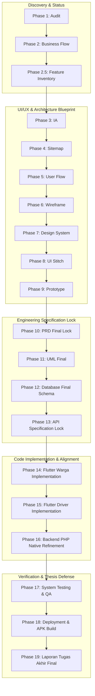

# MASTER PROJECT PLAN & TECHNICAL ROADMAP
**Sistem Informasi Bank Sampah Bersinar — Modul Penjemputan Sampah Berbasis Mobile**
*Single Source of Truth (SSOT) & Blueprint Pengembangan Proyek Tugas Akhir*

---

## 1. PROJECT VISION (*Visi & Ruang Lingkup Proyek*)

### 1.1 Tujuan Aplikasi
Membangun sistem informasi manajemen Bank Sampah yang terintegrasi secara *real-time* antara Nasabah (Warga), Armada Penjemput (Driver), dan Pengelola Gudang (Petugas Bank Sampah) untuk meningkatkan efisiensi operasional penjemputan sampah, menjamin keakuratan penimbangan fisik muatan, dan memberikan transparansi reward poin kepada masyarakat.

### 1.2 Ruang Lingkup Penelitian (*Research Scope*)
- **Fokus Utama Penelitian**: **Alur Penjemputan Sampah oleh Driver (*Online Pick-up Workflow*)** mulai dari pembuatan pesanan oleh warga, penugasan driver, penimbangan lapangan, serah terima di gudang, penimbangan akhir oleh petugas, hingga otomatisasi kalkulasi dan penyaluran poin.
- **Model Penimbangan 3 Tahap**:
  1. *Tahap 1 — Estimasi Warga (`estimasi_berat_kg`)*: Perkiraan awal oleh warga saat membuat pesanan (`pending`). Menghasilkan estimasi poin sebagai informasi awal (poin belum masuk ke akun).
  2. *Tahap 2 — Penimbangan Awal Driver (`berat_driver_kg`)*: Pencatatan berat operasional di lapangan oleh driver saat mengambil sampah di rumah warga (`picked_up`). Berfungsi sebagai bukti serah terima lapangan.
  3. *Tahap 3 — Penimbangan Akhir Petugas (`berat_aktual_kg`)*: Penimbangan ulang dan pemeriksaan kualitas di gudang Bank Sampah oleh petugas (`validating` → `completed`). Angka final ini menjadi **acuan mutlak (*Final Authority*)** perhitungan poin resmi.
- **Alur 6 Status Pesanan**: `pending` → `accepted` → `on_the_way` → `picked_up` → `validating` → `completed`.

### 1.3 Target Pengguna (*Target Personas*)
1. **Warga (*Nasabah*)**: Menggunakan aplikasi mobile Flutter (`/Mobile`) untuk mengajukan jemputan, melihat estimasi poin, memantau status perjalanan, dan menerima poin reward.
2. **Driver (*Armada Penjemput*)**: Menggunakan aplikasi mobile Flutter (`/Halaman-Driver`) untuk menerima tugas jemput, memperbarui status perjalanan, dan mencatat penimbangan awal lapangan.
3. **Petugas Bank Sampah (*Pengelola Gudang / Admin*)**: Menggunakan portal Web Admin PHP (`/bank_sampah`) untuk mengelola master data, memvalidasi serah terima sampah dari driver, menimbang ulang, dan menyelesaikan pesanan.

### 1.4 Batasan Penelitian (*Technical & Scope Boundaries*)
- **Arsitektur Backend**: Menggunakan **PHP Native REST API** (PHP 8 prosedural dan modular di direktori `modules/api/*.php`) dengan *Prepared Statements* dan *Token Authentication*. **Bukan framework Laravel.**
- **Pengembangan Berikutnya (*Future Work*)**: Mekanisme setor langsung secara offline di kantor Bank Sampah (`transaksi`) diposisikan sebagai saran pengembangan selanjutnya di Bab V Laporan Tugas Akhir.

---

## 2. CURRENT PROJECT STATUS (*Status Audit Proyek Eksisting*)

Berdasarkan audit komprehensif yang telah dilakukan pada kode, struktur direktori, dan database eksisting, berikut adalah peta persentase kesiapan dan kondisi terkini:

| Komponen Proyek | Persentase Kesiapan | Kondisi Eksisting | Kesenjangan / Pekerjaan yang Harus Diselesaikan |
| :--- | :---: | :--- | :--- |
| **Flutter Warga (`/Mobile`)** | **80%** | Struktur `core/` dan `features/` sudah rapi. Form buat order, riwayat, profil, dan deteksi ML sudah tersedia. | Perlu penyesuaian label UI untuk 6 status resmi (khususnya status baru `validating` → *"Sampah Sedang Divalidasi"*) dan konsistensi penanganan error/dialog. |
| **Flutter Driver (`/Halaman-Driver`)** | **75%** | Alur login, dasbor tugas aktif (`get_active_task`), detail jemputan, dan riwayat sudah berjalan dengan `setState`. | Perlu penambahan input `berat_driver_kg` pada form verifikasi lapangan (`picked_up`) dan pembaruan status ke `validating` saat tiba di gudang. |
| **Backend PHP Native (`/bank_sampah`)** | **80%** | Portal Web Admin dan endpoint REST API `modules/api/*.php` sudah fungsional melayani autentikasi, order, dan profil. | Perlu penyesuaian pada `modules/orders/index.php` untuk menambahkan input `berat_aktual_kg` serta membungkus kueri `completed` dan penambahan `pengguna.saldo` dalam satu transaksi atomic database (ACID). |
| **Database (`db_banksampah`)** | **85%** | Relasi antar tabel `pengguna`, `orders`, `order_items`, `jenis_sampah`, `notifikasi`, dan `detail_driver` sudah terstruktur dengan baik. | Perlu migrasi kecil: penambahan enum `'validating'` pada `orders.status` dan penambahan kolom `berat_driver_kg` pada tabel `order_items`. |
| **REST API (`modules/api/*.php`)** | **80%** | Endpoint JSON sudah melayani permintaan dasar aplikasi mobile dengan otorisasi `Bearer Token`. | Perlu standardisasi respons JSON, validasi parameter input pada penimbangan 3 tahap, serta penegasan batas waktu (*expiration*) token API. |
| **PRD & Alur Bisnis** | **90%** | Spesifikasi alur 6 status dan model penimbangan 3 tahap telah disepakati bersama. | Tinggal diformalisasi secara berkelanjutan ke dalam spesifikasi per modul dan dijadikan lampiran resmi Laporan Tugas Akhir. |
| **UML & Analisis Sistem** | **80%** | Draf Use Case, Activity, Sequence, dan ERD sudah sinkron dengan alur bisnis baru. | Perlu digambar/dirender ulang dalam resolusi tinggi untuk kebutuhan Bab III/Bab IV Laporan Tugas Akhir. |
| **UI/UX & Design Architecture** | **70%** | Desain antarmuka eksisting di kedua aplikasi Flutter sudah interaktif dan rapi. | Perlu pemantapan Information Architecture (IA), Sitemap, User Flow, dan Wireframe agar dokumentasi perancangan UI/UX di Bab III Laporan TA terlihat sangat matang dan profesional. |

---

## 3. PROJECT ROADMAP (*Roadmap Bertahap & Terstruktur*)

Pengembangan proyek ini dibagi ke dalam **19 Tahapan (*Phases*)** yang berjalan secara berurutan dan terstruktur. **Aturan Mutlak: Tidak boleh melompat ke tahap implementasi kode/database sebelum tahapan perancangan dan spesifikasi diselesaikan dan disetujui.**

```text
[PHASE 1: Audit Project] (SELESAI)
        ↓
[PHASE 2: Business Flow & Status Mapping] (SELESAI KONSEPTUAL)
        ↓
[PHASE 2.5: Feature Inventory] (SELESAI)
        ↓
[PHASE 3: Content Inventory] (SELESAI)
        ↓
[PHASE 3.5: Information Architecture (IA)] (SELESAI)
        ↓
[PHASE 3.75: Screen Catalog & Interface Spec] (SELESAI)
        ↓
[PHASE 4: Sitemap] (SELESAI)
        ↓
[PHASE 5: User Flow] (SELESAI)
        ↓
[PHASES 6–9: Unified UI/UX Architecture & Design System (UI_REQUIREMENTS.md)] (SELESAI)
        ↓
[PHASE 10: PRD Final & Specification Lock]
        ↓
[PHASE 11: UML Final (Use Case, Activity, Sequence, Class Diagram)]
        ↓
[PHASE 12: Database Final Schema (DDL & ERD Lock)]
        ↓
[PHASE 13: API Final Specification (Endpoint Lock & Contract)]
        ↓
[PHASE 14: Flutter Warga Implementation & Alignment (/Mobile)]
        ↓
[PHASE 15: Flutter Driver Implementation & Alignment (/Halaman-Driver)]
        ↓
[PHASE 16: Backend PHP Native & Web Admin Refinement (/bank_sampah)]
        ↓
[PHASE 17: System Testing & Quality Assurance]
        ↓
[PHASE 18: Deployment & Server Hardening]
        ↓
[PHASE 19: Dokumentasi & Penyusunan Laporan Tugas Akhir]
```

---

## 4. DETAIL SETIAP PHASE (*Detailed Phase Specifications*)

### PHASE 1: Audit Project *(Status: SELESAI)*
- **Tujuan**: Memetakan struktur direktori, arsitektur, kode sumber, skema database, dan API eksisting secara menyeluruh tanpa mengubah kode.
- **Output**: Laporan audit teknis eksisting dan pemetaan kesenjangan (*Gap Analysis*).
- **Dokumen yang Dihasilkan**: Audit Report di transkrip percakapan & `MASTER_PROJECT_PLAN.md`.
- **Hal yang Harus Disiapkan**: Akses ke folder `/Mobile`, `/Halaman-Driver`, `/bank_sampah`, dan file SQL.
- **Risiko**: Salah interpretasi terhadap struktur legacy PHP atau arsitektur Flutter. *(Mitigasi: Pengecekan langsung via `list_dir` dan `view_file` berhasil dilakukan)*.
- **Ketergantungan**: -

### PHASE 2: Business Flow & Status Mapping *(Status: SELESAI KONSEPTUAL)*
- **Tujuan**: Menyepakati alur bisnis penjemputan sampah, pemetaan 6 status order (`pending` → `completed`), dan model penimbangan 3 tahap.
- **Output**: Ketetapan alur logika operasional resmi Bank Sampah Bersinar.
- **Dokumen yang Dihasilkan**: Draf Alur Bisnis Master & Sequence Diagram Konseptual.
- **Hal yang Harus Disiapkan**: Hasil wawancara/diskusi spesifikasi bersama Product Owner (Penulis TA).
- **Risiko**: Perubahan alur di tengah masa pemrograman. *(Mitigasi: Dikunci di dokumen ini sebagai SSOT)*.
- **Ketergantungan**: Phase 1.

### PHASE 2.5: Feature Inventory *(Status: SELESAI)*
- **Tujuan**: Membuat inventarisasi seluruh fitur sistem, pengelompokan modul, pemetaan halaman, analisis kesenjangan, dan pemetaan fitur baru sebagai fondasi perancangan IA & desain.
- **Output**: Katalog master seluruh fitur aplikasi per aktor dan per modul.
- **Dokumen yang Dihasilkan**: Dokumen `FEATURE_INVENTORY.md`.
- **Hal yang Harus Disiapkan**: Hasil Audit (Phase 1) dan Alur Bisnis (Phase 2).
- **Risiko**: Fitur liar di luar ruang lingkup penelitian yang mengganggu fokus TA.
- **Ketergantungan**: Phase 2.

### PHASE 3: Content Inventory *(Status: SELESAI)*
- **Tujuan**: Mendefinisikan rincian spesifikasi konten, komponen UI, struktur data yang dibutuhkan, aksi pengguna, aturan bisnis, dan relasi navigasi pada setiap layar aplikasi untuk 3 aktor.
- **Output**: Katalog spesifikasi konten dan spesifikasi antarmuka yang merinci penimbangan 3 tahap & 6 status order.
- **Dokumen yang Dihasilkan**: Dokumen `CONTENT_INVENTORY.md`.
- **Hal yang Harus Disiapkan**: Feature Inventory (Phase 2.5) dan Alur Bisnis (Phase 2).
- **Risiko**: Ada elemen UI atau field data yang terlewat saat perancangan spesifikasi layar lanjutan.
- **Ketergantungan**: Phase 2.5.

### PHASE 3.5: Information Architecture (IA) *(Status: SELESAI)*
- **Tujuan**: Merancang pengelompokan informasi, hierarki data, taksonomi domain, tingkatan navigasi, dan relasi konten untuk ketiga antarmuka (Warga, Driver, Web Admin).
- **Output**: Bagan dan spesifikasi Information Architecture yang mengorganisasikan informasi sistem.
- **Dokumen yang Dihasilkan**: Dokumen `INFORMATION_ARCHITECTURE.md`.
- **Hal yang Harus Disiapkan**: Content Inventory (Phase 3).
- **Risiko**: Over-complication (memasukkan fitur di luar ruang lingkup penjemputan).
- **Ketergantungan**: Phase 3.

### PHASE 3.75: Screen Catalog & Interface Specification *(Status: SELESAI)*
- **Tujuan**: Merinci spesifikasi 18 parameter teknis untuk setiap layar (Screen ID, role, komponen UI, state management, aturan bisnis, dependency) sebagai penghubung IA menuju Wireframe & coding.
- **Output**: Katalog matriks layar dan spesifikasi presisi untuk 17 kelas layar/modul pada 3 aktor.
- **Dokumen yang Dihasilkan**: Dokumen `SCREEN_CATALOG.md`.
- **Hal yang Harus Disiapkan**: Information Architecture (Phase 3.5).
- **Risiko**: Kesalahan tafsir aturan bisnis 3 tahap berat pada desain UI/UX lanjutan jika spesifikasi kurang spesifik.
- **Ketergantungan**: Phase 3.5.

### PHASE 4: Sitemap *(Status: SELESAI)*
- **Tujuan**: Memetakan struktur pohon halaman (*Page Tree / Sitemap*) untuk aplikasi Mobile Warga, Mobile Driver, dan portal Web Admin.
- **Output**: Peta situs yang memperlihatkan kedalaman navigasi dan relasi antar layar/halaman.
- **Dokumen yang Dihasilkan**: Dokumen `SITEMAP.md` beserta diagram pohon navigasi.
- **Hal yang Harus Disiapkan**: Hasil perancangan Information Architecture (Phase 3.5) dan Screen Catalog (Phase 3.75).
- **Risiko**: Terdapat halaman *orphan* (halaman yang tidak dapat diakses dari menu manapun).
- **Ketergantungan**: Phase 3.75.

### PHASE 5: User Flow *(Status: SELESAI)*
- **Tujuan**: Merancang langkah-langkah interaksi spesifik (*step-by-step user journey*) untuk setiap *Use Case* utama (contoh: Alur Warga Buat Order, Alur Driver Timbang Awal, Alur Petugas Validasi Gudang).
- **Output**: Diagram alur pengguna (*User Flow Diagram*) yang mendetail untuk setiap peran.
- **Dokumen yang Dihasilkan**: Dokumen `USER_FLOW.md` dengan diagram alur logika interaksi, penanganan error, dan matriks keputusan.
- **Hal yang Harus Disiapkan**: Sitemap (Phase 4), Screen Catalog (Phase 3.75), dan Alur Bisnis (Phase 2).
- **Risiko**: Alur yang terlalu panjang atau membingungkan bagi pengguna awam.
- **Ketergantungan**: Phase 4.

### PHASES 6–9: Unified UI/UX Architecture & Design System *(Status: SELESAI — Konsolidasi `UI_REQUIREMENTS.md`)*
- **Tujuan**: Mempercepat roadmap proyek dengan menyatukan rancangan tata letak (*Wireframe*), katalog token visual (*Design System*), spesifikasi komponen (*Stitch High-Fidelity*), dan pemetaan antarmuka (*Prototype Spec*) ke dalam satu dokumen induk terpadu.
- **Output**: Master Spesifikasi UI/UX, Design Tokens (Hex/RGB/Scale), dan tata letak untuk 17 layar/modul pada 3 platform (`/Mobile`, `/Halaman-Driver`, `/bank_sampah`).
- **Dokumen yang Dihasilkan**: Dokumen `UI_REQUIREMENTS.md` (menggantikan kebutuhan dokumen terpecah `WIREFRAMES_SPEC.md`, `DESIGN_SYSTEM.md`, dan `UI_PROTOTYPE_SPEC.md`).
- **Hal yang Harus Disiapkan**: User Flow (`USER_FLOW.md`), Sitemap (`SITEMAP.md`), dan Screen Catalog (`SCREEN_CATALOG.md`).
- **Risiko**: Inkonsistensi implementasi kode jika developer tidak mematuhi pemetaan token warna dan rasio kontras.
- **Ketergantungan**: Phase 5.
- **Ketergantungan**: Phase 8.

### PHASE 10: PRD Final & Specification Lock
- **Tujuan**: Mengunci seluruh spesifikasi fungsional (FR), non-fungsional (NFR), aturan bisnis, dan spesifikasi antarmuka ke dalam dokumen resmi produk yang final.
- **Output**: Dokumen PRD final yang tidak boleh diubah tanpa persetujuan formal.
- **Dokumen yang Dihasilkan**: Dokumen `PRD_FINAL_LOCK.md`.
- **Hal yang Harus Disiapkan**: Hasil verifikasi UI (Phase 9) dan rumusan alur bisnis (Phase 2).
- **Risiko**: Terdapat ambiguitas spesifikasi yang terlewat.
- **Ketergantungan**: Phase 9.

### PHASE 11: UML Final (Use Case, Activity, Sequence, Class Diagram)
- **Tujuan**: Menyusun seluruh diagram pemodelan sistem berstandar akademis yang konsisten 100% dengan PRD Final untuk kebutuhan analisis sistem di Laporan Tugas Akhir.
- **Output**: Diagram Use Case, Activity Diagram (Swimlane), Sequence Diagram (3 Tahap Penimbangan), dan Class Diagram.
- **Dokumen yang Dihasilkan**: Dokumen `UML_SYSTEM_ANALYSIS_FINAL.md` beserta render diagram Mermaid.
- **Hal yang Harus Disiapkan**: PRD Final Lock (Phase 10).
- **Risiko**: Inkonsistensi nama metode/parameter antara Class Diagram dan implementasi kode PHP/Flutter.
- **Ketergantungan**: Phase 10.

### PHASE 12: Database Final Schema (DDL & ERD Lock)
- **Tujuan**: Merancang dan mengunci skema database akhir (ERD), termasuk migrasi penambahan enum `validating` pada tabel `orders` dan kolom `berat_driver_kg` pada tabel `order_items`.
- **Output**: Skema ERD Final dan skrip SQL migrasi siap pakai (`migration_final_pickups.sql`).
- **Dokumen yang Dihasilkan**: Dokumen `DATABASE_SCHEMA_FINAL.md` dan file SQL migrasi.
- **Hal yang Harus Disiapkan**: UML Final (Phase 11).
- **Risiko**: Kegagalan integritas *foreign key* saat migrasi dijalankan pada database eksisting.
- **Ketergantungan**: Phase 11.

### PHASE 13: API Final Specification (Endpoint Lock & Contract)
- **Tujuan**: Mengunci kontrak antarmuka pemrograman aplikasi (*API Contract / Endpoint Specification*) antara backend PHP Native dengan aplikasi mobile Flutter.
- **Output**: Dokumentasi rincian parameter request, format header (`Bearer Token`), struktur JSON response sukses/error untuk setiap endpoint.
- **Dokumen yang Dihasilkan**: Dokumen `API_SPECIFICATION_FINAL.md`.
- **Hal yang Harus Disiapkan**: Database Schema Final (Phase 12) dan PRD Final (Phase 10).
- **Risiko**: Ketidakcocokan struktur JSON yang menyebabkan kesalahan parsing di Flutter (`ApiResponse`).
- **Ketergantungan**: Phase 12.

### PHASE 14: Flutter Warga Implementation & Alignment (`/Mobile`)
- **Tujuan**: Menyempurnakan kode aplikasi Mobile Warga agar selaras 100% dengan API Contract (Phase 13), Design System (Phase 7), dan penambahan pemetaan status `validating`.
- **Output**: Kode aplikasi Flutter Warga yang bersih, fungsional, bebas *linter error*, dan sesuai UI/UX.
- **Dokumen yang Dihasilkan**: Source code terperbarui di `/Mobile` dan catatan rilis (*Changelog*).
- **Hal yang Harus Disiapkan**: API Final Specification (Phase 13) dan Design System (Phase 7).
- **Risiko**: *Build error* akibat ketidakcocokan versi paket di `pubspec.yaml`.
- **Ketergantungan**: Phase 13.

### PHASE 15: Flutter Driver Implementation & Alignment (`/Halaman-Driver`)
- **Tujuan**: Menyempurnakan aplikasi Mobile Driver dengan menambahkan input `berat_driver_kg` saat update status ke `picked_up` serta kemampuan update status ke `validating` saat tiba di gudang.
- **Output**: Kode aplikasi Flutter Driver yang sepenuhnya mendukung alur penimbangan tahap 2 dan serah terima.
- **Dokumen yang Dihasilkan**: Source code terperbarui di `/Halaman-Driver` dan catatan rilis (*Changelog*).
- **Hal yang Harus Disiapkan**: API Final Specification (Phase 13) dan Flutter Warga alignment (Phase 14).
- **Risiko**: Kesalahan penanganan koordinat peta atau gangguan koneksi saat penimbangan lapangan.
- **Ketergantungan**: Phase 14.

### PHASE 16: Backend PHP Native & Web Admin Refinement (`/bank_sampah`)
- **Tujuan**: Menerapkan skrip migrasi database (Phase 12), memperbarui endpoint API `modules/api/*.php` sesuai kontrak (Phase 13), dan menyempurnakan `modules/orders/index.php` di Web Admin dengan form input `berat_aktual_kg` dan transaksi atomic database (ACID) untuk kalkulasi/penyuntikan poin otomatis.
- **Output**: Backend PHP Native yang tangguh, aman (*Prepared Statements*), dan mendukung penuh alur 3 tahap penimbangan.
- **Dokumen yang Dihasilkan**: Source code terperbarui di `/bank_sampah` dan skrip migrasi ter-apply.
- **Hal yang Harus Disiapkan**: Database Schema Final (Phase 12) dan API Specification (Phase 13).
- **Risiko**: *Race condition* atau kegagalan transaksi database saat penutupan order secara bersamaan.
- **Ketergantungan**: Phase 15.

### PHASE 17: System Testing & Quality Assurance
- **Tujuan**: Melakukan pengujian sistem menyeluruh mencakup *Unit Testing* logika perhitungan poin, *API Integration Testing*, *UI/UX Usability Testing*, dan *End-to-End (E2E) User Acceptance Testing (UAT)* untuk ketiga peran pengguna.
- **Output**: Laporan hasil pengujian sistem dan jaminan bebas *bug* kritis.
- **Dokumen yang Dihasilkan**: Dokumen `SYSTEM_TESTING_AND_UAT_REPORT.md`.
- **Hal yang Harus Disiapkan**: Seluruh komponen aplikasi (Phase 14, 15, 16) yang terhubung di server pengujian.
- **Risiko**: Terdapat skenario *edge case* (misal: order dibatalkan setelah penimbangan awal) yang belum tercover.
- **Ketergantungan**: Phase 16.

### PHASE 18: Deployment & Server Hardening
- **Tujuan**: Mempersiapkan lingkungan konfigurasi produksi (*Production Environment*), pengamanan server Apache/PHP, pengaturan hak akses direktori upload, dan persiapan *APK build release* untuk Flutter Warga dan Driver.
- **Output**: Sistem live yang siap didemonstrasikan pada saat sidang/presentasi Tugas Akhir serta berkas APK siap pasang.
- **Dokumen yang Dihasilkan**: Dokumen `DEPLOYMENT_AND_INSTALLATION_GUIDE.md`.
- **Hal yang Harus Disiapkan**: Laporan pengujian sukses (Phase 17) dan spesifikasi server/hosting.
- **Risiko**: Perbedaan konfigurasi environment lokal (Laragon Windows) dengan server Linux produksi.
- **Ketergantungan**: Phase 17.

### PHASE 19: Dokumentasi & Penyusunan Laporan Tugas Akhir
- **Tujuan**: Menyusun dan menyelaraskan seluruh lampiran teknis (PRD, UML, ERD, API Spec, Hasil Pengujian, Screenshot UI) ke dalam struktur bab Laporan Tugas Akhir (Bab III: Metodologi & Perancangan, Bab IV: Implementasi & Pengujian, Bab V: Kesimpulan & Saran).
- **Output**: Bab teknis Laporan Tugas Akhir yang konsisten, sempurna, akademis, dan siap dipertahankan di depan dewan penguji.
- **Dokumen yang Dihasilkan**: Draf Bab III, Bab IV, dan Bab V Laporan Tugas Akhir beserta lampiran rekayasa perangkat lunak.
- **Hal yang Harus Disiapkan**: Seluruh dokumen spesifikasi dari Phase 1 hingga Phase 18.
- **Risiko**: Kesalahan kutipan angka atau inkonsistensi penomoran gambar diagram di laporan tertulis.
- **Ketergantungan**: Phase 18.

---

## 5. CHECKLIST MASTER PENGEMBANGAN PROYEK (*Master Project Checklist*)

Gunakan daftar centang di bawah ini untuk memantau kemajuan proyek secara *real-time*:

### Perancangan Arsitektur & UI/UX (Phases 1–9)
- [x] **PHASE 1: Audit Project Eksisting** — *Laporan struktur folder, arsitektur, dan gap analysis selesai.*
- [x] **PHASE 2: Business Flow & Status Mapping** — *Alur 6 status dan 3 tahap penimbangan disepakati.*
- [x] **PHASE 2.5: Feature Inventory** — *Katalog fitur master dan gap analysis selesai (`FEATURE_INVENTORY.md`).*
- [x] **PHASE 3: Content Inventory** — *Spesifikasi konten per halaman selesai (`CONTENT_INVENTORY.md`).*
- [x] **PHASE 3.5: Information Architecture (IA)** — *Hierarki informasi & taksonomi sistem selesai (`INFORMATION_ARCHITECTURE.md`).*
- [x] **PHASE 3.75: Screen Catalog & Interface Spec** — *Spesifikasi 18 parameter per layar selesai (`SCREEN_CATALOG.md`).*
- [x] **PHASE 4: Sitemap** — *Peta pohon navigasi aplikasi Warga, Driver, dan Web Admin selesai (`SITEMAP.md`).*
- [x] **PHASE 5: User Flow** — *Alur langkah demi langkah untuk Use Case penjemputan & validasi selesai (`USER_FLOW.md`).*
- [x] **PHASES 6–9: Unified UI/UX Architecture & Design System** — *Konsolidasi Wireframe, Design Tokens, Stitch, dan UI Spec selesai dalam satu dokumen induk (`UI_REQUIREMENTS.md`).*

### Finalisasi Blueprint & Spesifikasi Teknis (Phases 10–13)
- [ ] **PHASE 10: PRD Final & Specification Lock** — *Penguncian spesifikasi fungsional dan aturan bisnis.*
- [ ] **PHASE 11: UML Final** — *Use Case, Activity, Sequence (3 tahap berat), dan Class Diagram.*
- [ ] **PHASE 12: Database Final Schema** — *ERD akhir dan skrip SQL migrasi (`validating` & `berat_driver_kg`).*
- [ ] **PHASE 13: API Final Specification** — *Kontrak JSON REST API dan spesifikasi Bearer Token.*

### Implementasi & Penyelarasan Kode (Phases 14–16) — *LOCKED UNTIL PHASE 13 COMPLETE*
- [ ] **PHASE 14: Flutter Warga (`/Mobile`)** — *Penyelarasan UI 6 status dan konsistensi API wrapper.*
- [ ] **PHASE 15: Flutter Driver (`/Halaman-Driver`)** — *Implementasi input `berat_driver_kg` & status `validating`.*
- [ ] **PHASE 16: Backend PHP Native (`/bank_sampah`)** — *Migrasi DB, update API, form `berat_aktual_kg` & transaksi atomic.*

### Pengujian, Deployment & Laporan TA (Phases 17–19)
- [ ] **PHASE 17: System Testing & QA** — *Unit test poin, API integration, dan E2E UAT 3 peran.*
- [ ] **PHASE 18: Deployment & Server Hardening** — *Persiapan server produksi dan build release APK.*
- [ ] **PHASE 19: Dokumentasi Laporan Tugas Akhir** — *Penyelarasan Bab III, IV, V dengan seluruh blueprint.*

---

## 6. PRIORITY MATRIX (*Matriks Prioritas Pekerjaan*)

| Prioritas | Tahapan (*Phases*) | Alasan & Dampak terhadap Tugas Akhir |
| :---: | :--- | :--- |
| **HIGH<br/>*(KRITIS)*** | **Phase 10 (PRD Lock)<br/>Phase 11 (UML Final)<br/>Phase 12 (Database Final)<br/>Phase 13 (API Final)<br/>Phase 16 (Backend & Atomic DB)<br/>Phase 19 (Laporan TA)** | Merupakan tulang punggung (*backbone*) akurasi ilmiah Tugas Akhir. Kesalahan pada skema database, UML, atau logika transaksi atomic di backend akan langsung mengurangi keabsahan sistem saat diuji oleh dosen pembimbing dan penguji. |
| **MEDIUM<br/>*(PENTING)*** | **Phase 3 (IA)<br/>Phase 4 (Sitemap)<br/>Phase 5 (User Flow)<br/>Phase 14 (Flutter Warga)<br/>Phase 15 (Flutter Driver)<br/>Phase 17 (Testing & UAT)** | Menjamin kelancaran demonstrasi aplikasi di depan dewan penguji serta membuktikan bahwa implementasi antarmuka selaras dengan spesifikasi perancangan perangkat lunak. |
| **LOW<br/>*(PENDUKUNG)*** | **Phase 6 (Wireframe)<br/>Phase 7 (Design System)<br/>Phase 8 (UI Stitch)<br/>Phase 9 (Prototype)<br/>Phase 18 (Deployment)** | Sangat mempercantik nilai estetika laporan dan presentasi visual, namun sebagian besar UI aplikasi Flutter eksisting sudah 75-80% berjalan sehingga penyesuaian visual ini bersifat menyempurnakan (*refining*). |

---

## 7. DEPENDENCY TREE & WORKFLOW CHAIN (*Rantai Ketergantungan Kerja*)

Secara visual, rantai ketergantungan mutlak (*Strict Dependency Chain*) pengembangan proyek ini dipetakan sebagai berikut:



**Aturan Rantai Kerja Mutlak**:
1. **Pekerjaan Implementasi Kode (Phase 14, 15, 16) dilarang keras dimulai** sebelum **Phase 10, 11, 12, dan 13 selesai dan dikunci (*Locked*)**.
2. **Phase 12 (Database)** dan **Phase 13 (API Contract)** adalah prasyarat wajib sebelum pengeditan satu baris pun pada direktori `/Mobile`, `/Halaman-Driver`, atau `/bank_sampah`.

---

## 8. REALISTIC MILESTONES (*Pencapaian Utama Proyek*)

Seluruh 19 tahapan di atas dikelompokkan ke dalam **5 Milestone Utama** untuk memudahkan pelaporan kemajuan kepada dosen pembimbing maupun evaluasi mandiri:

### 🏆 Milestone 1: Discovery & Conceptual Alignment *(STATUS: TERCAPAI)*
- **Cakupan**: Phase 1 (Audit Project) & Phase 2 (Business Flow & Status Mapping).
- **Hasil Utama**: Audit struktur direktori eksisting, kesepakatan alur 6 status order (`pending` → `completed`), dan penetapan model penimbangan 3 tahap (`estimasi_berat_kg`, `berat_driver_kg`, `berat_aktual_kg`).

### 🏆 Milestone 2: UI/UX & Product Design Architecture *(STATUS: SIAP DIMULAI)*
- **Cakupan**: Phase 3 (IA), Phase 4 (Sitemap), Phase 5 (User Flow), Phase 6 (Wireframe), Phase 7 (Design System), Phase 8 (UI Stitch), dan Phase 9 (Prototype Verification).
- **Hasil Utama**: Paket lengkap spesifikasi rancang bangun antarmuka pengguna yang terstruktur akademis untuk disematkan pada Bab III Laporan Tugas Akhir.

### 🏆 Milestone 3: Technical Blueprint & Engineering Specifications *(STATUS: MENUNGGU M-2)*
- **Cakupan**: Phase 10 (PRD Final Lock), Phase 11 (UML Final), Phase 12 (Database Schema Final), dan Phase 13 (API Specification Lock).
- **Hasil Utama**: Penguncian dokumen rekayasa perangkat lunak (*Single Source of Truth*) yang menjadi dasar mutlak pemrograman sistem.

### 🏆 Milestone 4: Core Implementation & Integration *(STATUS: MENUNGGU M-3)*
- **Cakupan**: Phase 14 (Flutter Warga), Phase 15 (Flutter Driver), dan Phase 16 (Backend PHP Native & Web Admin).
- **Hasil Utama**: Sistem terintegrasi penuh yang mendukung alur penjemputan dari Warga → Driver → Gudang Bank Sampah dengan transaksi atomic poin.

### 🏆 Milestone 5: Verification, Deployment & Thesis Defense Readiness *(STATUS: MENUNGGU M-4)*
- **Cakupan**: Phase 17 (System Testing & QA), Phase 18 (Deployment & APK Release), dan Phase 19 (Dokumentasi Laporan Tugas Akhir).
- **Hasil Utama**: Aplikasi *live* beroperasi tanpa *bug*, berkas APK siap pasang, dan naskah Laporan Tugas Akhir (Bab III, IV, V) yang sempurna dan siap disidangkan.

---
*Dokumen ini adalah acuan mutlak proyek. Setiap perubahan pada spesifikasi harus diperbarui terlebih dahulu pada dokumen ini sebelum diterapkan pada implementasi teknis.*
