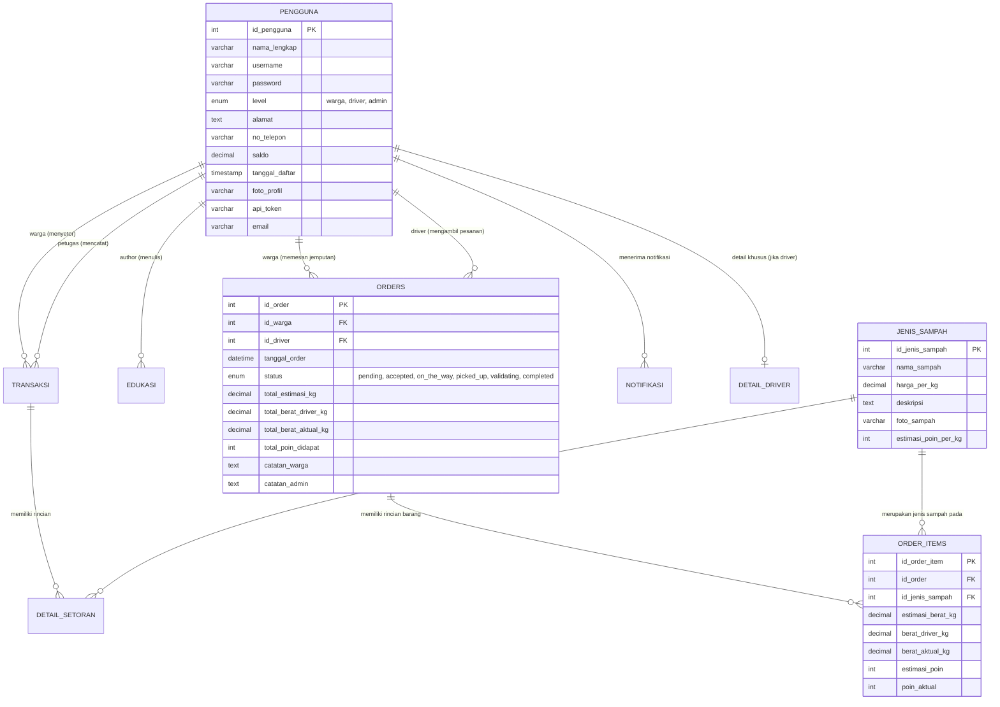

# PROJECT_HANDOVER.md — Bank Sampah Bersinar Technical & Architectural Handover
**Project Name:** Sistem Informasi Bank Sampah Bersinar (Mobile Tugas Akhir — Citizen, Driver & Web Admin)  
**Document Purpose:** Definitive Onboarding Guide, Single Source of Truth (SSOT), & Comprehensive Technical Reference for Human Developers and AI Assistants  
**Single Source of Truth (SSOT) Version:** 2.1.0 (Post-UI Polish, App Initializer Migration & Reward Redemption Lockdown)  
**Last Updated:** July 16, 2026  

---

## EXECUTIVE SUMMARY & AUDIT OVERVIEW
This document serves as the absolute **Single Source of Truth (SSOT)** and comprehensive technical handover for the **Bank Sampah Bersinar** ecosystem (`iTrashy`). It consolidates and eliminates all previous redundant documentation (`MASTER_PROJECT_PLAN.md`, `DEVELOPMENT_HANDOVER.md`, `FEATURE_INVENTORY.md`, `SCREEN_CATALOG.md`, `UI_REQUIREMENTS.md`, `SITEMAP.md`, `USER_FLOW.md`, `CONTENT_INVENTORY.md`, `INFORMATION_ARCHITECTURE.md`, `erd_bank_sampah.md`) by reconciling their architectural blueprints directly against the active production codebase.

The system is composed of three interconnected sub-systems:
1. **Citizen Application (`/Mobile`)**: Built with Flutter & Material Design 3. Serves households for waste pickup requests, AI waste scanning, real-time tracking, eco-points accumulation, and point redemption (`Tukar Poin`).
2. **Driver Application (`/Halaman-Driver`)**: Built with Flutter. Serves operational logistics personnel for task assignment, turn-by-turn navigation, and on-site initial weighing (`berat_driver_kg`).
3. **Backend & Web Admin (`/bank_sampah`)**: Built with PHP Native (Modular Procedural REST API & MySQL `db_banksampah`). Serves as the central data engine, JWT/Bearer auth provider, and warehouse final validation panel (`berat_aktual_kg`).

---

## 1. DOCUMENTATION VS. IMPLEMENTATION RECONCILIATION
During the rigorous inspection of the codebase vs. existing project documentation, several evolutions were discovered. Below is the explicit reconciliation establishing the **New Single Source of Truth**:

### A. Application Initializer & Startup Flow (v2.1.0 Migration)
- **What is Different:**
  - Previous iterations relied on a simple `SplashScreen` plus a duplicate `SplashIntroScreen` with ad-hoc delay timers before navigating.
  - The current architecture (`Mobile/lib/core/services/app_initializer_service.dart` & `Mobile/lib/features/auth/screens/splash_screen.dart`) establishes a true **Background Initialization Engine**. `AppInitializerService.instance.initializeApp()` runs 12 sequential/parallel system checks:
    1. Flutter bindings & orientation verification
    2. Firebase initialization check
    3. Google Authentication readiness check
    4. Previous session restoration (`AuthRepository.instance.isLoggedIn()`)
    5. Current user profile fetch & token validation
    6. Profile photo local synchronization
    7. Local storage configuration (`SharedPreferences`)
    8. Application settings verification
    9. Cache & temporary directory cleanup
    10. Dashboard initial data prefetching (active orders & recent redemptions)
    11. Push notification readiness check
    12. Network connectivity diagnostics
  - **Single Navigation Decision Point:** `SplashScreen` synchronizes the background initialization with its 2200ms visual animation using `Future.wait<dynamic>([initFuture, animFuture])`. Navigation occurs exactly once when both complete (`AppRoutes.main` or `AppRoutes.login`), eliminating double jumps (`Splash -> Login -> Dashboard`). Furthermore, `splash_intro_screen.dart` has been completely removed as dead/duplicate code.
- **Why it is Different:** Guarantees a rock-solid, zero-flash startup experience while pre-warming user state and preventing unauthenticated routing glitches.
- **New Single Source of Truth:** **`AppInitializerService` + Single-Transition `SplashScreen`** is the official SSOT.

### B. Order Status Workflow (6-Stage Backend vs. 7-Stage UI Timeline)
- **What is Different:**
  - `MASTER_PROJECT_PLAN.md` & `FEATURE_INVENTORY.md` document a **6-Stage Status ENUM**: `pending` → `accepted` → `on_the_way` → `picked_up` → `validating` → `completed`.
  - `DEVELOPMENT_HANDOVER.md` and the active code in `Mobile/lib/features/orders/screens/order_detail_screen.dart` (`_getStepIndex()`) render a **7-Stage Visual Timeline**:
    1. *Permintaan Dikirim* (`pending`)
    2. *Menunggu Konfirmasi* (UI Sub-state)
    3. *Driver Ditugaskan* (`accepted`)
    4. *Driver Menuju Lokasi* (`on_the_way`)
    5. *Sampah Dijemput* (`picked_up` — Tahap 2 Driver Weighing)
    6. *Validasi Bank Sampah* (`validating` — Tahap 3 Admin Weighing)
    7. *Selesai* (`completed` — Points Dispersed)
- **Why it is Different:** The UI splits `pending` into two user-facing milestones (*Permintaan Dikirim* and *Menunggu Konfirmasi*) to give citizens better psychological visibility during high-volume pickup dispatch queues, while the database strictly maintains 6 atomic state transitions.
- **New Single Source of Truth:** **The 6-Stage Database ENUM backed by the 7-Stage UI Presentation** is the official SSOT. Database migrations and API payloads must strictly use `pending`, `accepted`, `on_the_way`, `picked_up`, `validating`, and `completed`.

### C. Reward Redemption Module (`Tukar Poin`) & Nomenclature Standardization
- **What is Different:**
  - Older nomenclature inconsistently referred to point withdrawal as `Transfer Poin` or `Tukar Poin`.
  - In v2.1.0, all terminology has been standardized strictly to **`Tukar Poin`**.
  - `RedemptionDetailScreen` (`Mobile/lib/features/orders/screens/redemption_detail_screen.dart`) renders a complete transaction table (Transaction Number `TRX-...`, Submission Date, Estimated Processing Time `1x24 Jam Kerja`, dynamic Conversion Rate `100 Poin = Rp ...`), a Material 3 Info Banner (`#EAF8EF`), color-coded Admin Notes (`_buildAdminNoteCard`), a 4-Stage Timeline with backend timestamps (`submitted_at`, `verified_at`, `processed_at`, `completed_at`), and conditional Proof of Transfer modal viewing (`_buildProofSection`) when `transfer_proof_url` is returned. Processing states strictly use green-themed indicators (`AppColors.primary`).
- **New Single Source of Truth:** **`Tukar Poin` nomenclature + `RedemptionDetailScreen` comprehensive timeline/proof architecture** is the official SSOT.

### D. Citizen Registration & Mandatory Address Enforcement
- **What is Different:**
  - `UI_REQUIREMENTS.md` & `SCREEN_CATALOG.md` specify a 6-field registration form including `nama_lengkap` (Full Name) and `alamat` (Full Address).
  - The current implementation in `Mobile/lib/features/auth/screens/register_screen.dart` **removed `nama_lengkap` and `alamat` entirely**. Registration now requires only: `username`, `email`, `nomor_hp`, `password`, and `confirm_password`. Address defaults to an empty string (`''`).
  - To prevent invalid pickups, `Mobile/lib/core/utils/address_verification_helper.dart` (`checkAndPrompt`) intercepts every deposit initiation (*Setor Manual*, *Scan AI*, *Checkout*) and enforces address completion via an M3 modal dialog if `alamat` is empty or `'-'`.
- **Why it is Different:** This structural change reduces user onboarding friction (*time-to-first-value*) while guaranteeing 100% address accuracy when the user actually initiates a logistical transaction.
- **New Single Source of Truth:** **Streamlined Identity (`username` primary) + Just-in-Time Mandatory Address Verification** is the official SSOT.

### E. Google Sign-In Authentication & Revocation Flow
- **What is Different:**
  - Standard Google Sign-In implementations often retain cached account credentials upon logout, causing subsequent logins to auto-select the previous account without prompting.
  - In `Mobile/lib/core/services/google_auth_service.dart`, the logout sequence executes `FirebaseAuth.instance.signOut()`, `GoogleSignIn.signOut()`, and explicitly `GoogleSignIn.disconnect()`.
- **Why it is Different:** `GoogleSignIn.disconnect()` revokes the OAuth session tokens on the device, guaranteeing that the next time the user taps "Login with Google", the Android system always displays the clean **Google Account Picker**.
- **New Single Source of Truth:** **Full Revocation (`signOut + disconnect`)** is the official SSOT for Google authentication logout.

### F. Profile Picture Synchronization & Profile Info Modal
- **What is Different:**
  - Older specs treated the Profile Page as a static list and did not define cross-screen avatar broadcasting or windowed editing.
  - The implementation (`Mobile/lib/features/profile/screens/profile_screen.dart`) features **Broadcast-Driven Profile Synchronization**. Whenever a user updates their profile or avatar, `ProfileRepository().profileUpdateController` broadcasts to instantly refresh `HomeScreen`, `ProfileScreen`, and active dialogs. If unassigned, the system renders a clean Material `person` circular avatar (`never empty`). Furthermore, profile inspection is encapsulated in a windowed modal (`ProfileInfoDialog`).
- **Why it is Different:** To maintain visual continuity across the M3 eco-fintech interface and prevent stale profile data across cached screens.
- **New Single Source of Truth:** **Stream-Driven Broadcast Synchronization + Modal Profile Windows** is the official SSOT.

### G. UI Polish & Motion Design System
- **What is Different:** The current implementation introduces a comprehensive **Material Design 3 Motion Pass** not detailed in older `UI_REQUIREMENTS.md` specs:
  - **Shared Axis Page Transitions**: `AppPageTransitions` (`lib/core/navigation/app_page_transitions.dart`) applies 280ms `easeOutCubic` Shared Axis (`Fade + Slide Up`) and secondary scaling (`1.0 -> 0.98`) across all routes.
  - **Staggered Card Motion**: `StaggeredCardAnimation` (`lib/shared/widgets/staggered_animation.dart`) orchestrates sequential 50ms entry delays on `HomeScreen`.
  - **M3 Modal Motion**: `AppDialogTransitions` (`lib/core/navigation/app_dialog_transitions.dart`) standardizes all 18 dialogs/bottom sheets to `Fade + Scale` (0.90 -> 1.0) and rounded slide sheets (`top: Radius.circular(24)`).
  - **Micro-Interactions & Shimmer**: `ScaleTap` (0.97 scale), `PrimaryButton` elevation dynamics, `AnimatedSwitcher` on balance counters (`PointBadge`), and `ShimmerSkeleton` (`skeleton_loader.dart`).
- **New Single Source of Truth:** The code in `Mobile/lib/core/navigation/` and `Mobile/lib/shared/widgets/` is the official SSOT for all motion and UI standards.

---

## 2. SYSTEM ARCHITECTURE & DATABASE ERD
The system is anchored by MySQL `db_banksampah`. Below is the definitive Entity Relationship Diagram (ERD) defining the data boundaries between Citizens (`warga`), Drivers (`driver`), and Warehouse Admin (`petugas`):



### The 3-Stage Weighing Model Authority
1. **Stage 1 — Citizen Estimate (`estimasi_berat_kg`)**: Recorded when the citizen submits an order (`status = pending`). Serves as initial guidance; no points are credited.
2. **Stage 2 — Driver On-Site Weighing (`berat_driver_kg`)**: Recorded by the driver using the `/Halaman-Driver` app upon picking up the waste (`status = picked_up`). Serves as proof of physical handover from citizen to driver.
3. **Stage 3 — Warehouse Final Authority (`berat_aktual_kg`)**: Recorded by the warehouse officer via the Web Admin panel (`admin.php`) when verifying sorting quality (`status = validating` -> `completed`). **This value is the sole legal authority (`Final Authority`)** used to compute and credit `poin_aktual` into the citizen's `saldo`.

---

## 3. MODULE COMPLETION & DEVELOPMENT PROGRESS
Current active implementation status across the three sub-systems:

| Module / Layer | Status | Completion % | Description |
| :--- | :--- | :---: | :--- |
| **Authentication Module** (`Mobile/lib/features/auth/`) | **Completed** | 100% | Streamlined username registration, Google Sign-In with complete token revocation (`disconnect()`), password reset, and background initialization. |
| **Home Dashboard Module** (`Mobile/lib/features/home/`) | **Completed** | 100% | Dynamic greeting, balance/points display (`PointBadge`), action grid, staggered cards, and eco-education tips. |
| **Deposit & Checkout Module** (`Mobile/lib/features/deposit/`) | **Completed** | 100% | Multi-category waste grid, interactive weight slider, just-in-time mandatory address verification (`AddressVerificationHelper`), scan AI screen, and checkout. |
| **Orders & Tracking Module** (`Mobile/lib/features/orders/`) | **Completed** | 100% | Order history, 7-stage status timeline (`OrderDetailScreen`), dynamic driver tracking, and M3 cancellation dialogs. |
| **Reward & Tukar Poin Module** (`Mobile/lib/features/orders/`) | **Completed** | 100% | Point balance conversion, detailed redemption status (`RedemptionDetailScreen`), proof viewing modal, and admin note display. |
| **Driver Active Task Module** (`Halaman-Driver/lib/screens/`) | **Completed** | 100% | Active task dashboard, order acceptance, turn-by-turn navigation state, weight verification (`PickupVerificationScreen`), and order checklist. |
| **Backend REST API** (`bank_sampah/modules/api/`) | **Completed** | 95% | Modular procedural PHP endpoints supporting `auth_api.php`, `orders_api.php`, `driver_api.php`, `profile_api.php`, and `reward_api.php`. |
| **Web Admin Validation Panel** (`bank_sampah/admin.php`) | **In Progress** | 60% | Final warehouse inspection, actual weight verification (`berat_aktual_kg`), and final points calculation. |
| **Real-Time GPS Geolocation** | **In Progress** | 40% | Currently uses simulated coordinates on `DriverTrackingScreen`; requires WebSocket/Pusher or Firebase Cloud Messaging (FCM) integration. |

---

## 4. COMPREHENSIVE FEATURE CATALOG BY ACTOR

### A. Citizen App Features (`/Mobile`)
1. **Application Initializer (`AppInitializerService`)**: 12 parallel/sequential diagnostic checks running during the 2.2s visual splash screen.
2. **Authentication**: Username-primary registration (`username`, `email`, `nomor_hp`, `password`), Google OAuth sign-in with clean picker enforcement (`signOut + disconnect`), and token persistence via `SharedPreferences`.
3. **Dynamic Home Dashboard**: Real-time point balance counter with `AnimatedSwitcher`, 4 quick action buttons (Setor Manual, Scan AI, Tukar Poin, Riwayat), eco-carousel, and educational waste articles.
4. **Just-in-Time Mandatory Address Check**: Interceptors that prompt citizens to enter their address via a clean M3 modal (`AddressVerificationHelper.checkAndPrompt`) right when they initiate Setor Manual, Scan AI, or Checkout.
5. **Manual Deposit & Checkout**: Category grid with real-time pricing (`harga_per_kg`), interactive weight sliders (`0.5 kg` - `50.0 kg`), dynamic point calculation, time slot selection (`08:00 - 10:00`, etc.), and order submission.
6. **Order Tracking (`OrderDetailScreen`)**: Visual 7-stage progress indicator mapped to the 6-stage database ENUM, detailed itemized waste breakdown, and driver contact shortcuts.
7. **Tukar Poin (`RedemptionDetailScreen`)**: Point withdrawal request (`Tukar Poin`), conversion rate (`100 Poin = Rp ...`), transaction tracking (`TRX-...`), verified timeline, proof image modal, and color-coded verification notes.
8. **Profile & Account Management**: Broadcast-driven profile picture and info synchronization (`ProfileRepository.profileUpdateController`), modal `ProfileInfoDialog`, and secure logout.

### B. Driver App Features (`/Halaman-Driver`)
1. **Driver Authentication**: Secure login tied to `level = 'driver'` in `db_banksampah`.
2. **Active Task Dashboard**: Real-time list of assigned pickups (`status = accepted` or `on_the_way`).
3. **Turn-by-Turn Navigation State**: Interactive status toggles notifying the citizen that the driver is en route (`on_the_way`).
4. **On-Site Initial Weighing (`PickupVerificationScreen`)**: Input form allowing the driver to weigh each waste category at the citizen's door (`berat_driver_kg`) and confirm pickup (`status = picked_up`).
5. **Pickup Completion (`PickupCompletionScreen`)**: 3-item safety and verification checklist (`Bukti penimbangan sesuai`, `Sampah telah dikemas rapi`, `Siap diantar ke gudang`) before updating order state to `validating`.

### C. Web Admin Panel Features (`/bank_sampah/admin.php`)
1. **Master Data Management**: CRUD interfaces for citizens, drivers, waste categories (`jenis_sampah`), and educational content (`edukasi`).
2. **Warehouse Sorting & Verification**: Interface for warehouse officers to inspect incoming driver drop-offs (`status = validating`), input final sorted weights (`berat_aktual_kg`), and complete orders (`status = completed`), which atomically disperses points to citizen accounts.
3. **Reward Verification (`Tukar Poin` Admin)**: Panel to review citizen point withdrawal requests, upload bank transfer proof (`transfer_proof_url`), and mark redemptions as verified or rejected (`catatan_admin`).

---

## 5. TECHNICAL DEBT & RISK AUDIT (RECONCILED)
Per project guidelines, the following potential issues and architectural status are documented for human developers and AI assistants:

| Category | Location / File | Description & Impact | Current Status / Recommendation |
| :--- | :--- | :--- | :--- |
| **Lint / Clean Code** | `Mobile/lib/...` (`register_screen.dart`, `scan_screen.dart`, `splash_screen.dart`) | Dart static analysis warnings regarding async context gaps and optional parameters. | **RESOLVED (0 Issues)**: All async gaps guarded by strict `if (!mounted)` state checks; optional parameters cleaned up and verified clean via `flutter analyze`. |
| **Security / SQLi** | `bank_sampah/modules/api/auth_api.php` (Line 343)<br>`detect.php`, `orders_api.php`, `jenis_sampah_api.php` | Raw `mysqli_query` executions using direct string interpolation (e.g., `WHERE username = '$username'`) instead of `mysqli_prepare` / Prepared Statements. High SQL Injection risk. | Refactor all query executions in `modules/api/*.php` to use PHP `mysqli_prepare()` with `$stmt->bind_param()` strictly before public deployment. |
| **Security / Exposure** | `bank_sampah/*.php` (`test_*.php`, `check_*.php`) | 19+ standalone test and schema-check scripts reside directly in the public web document root (`bank_sampah/`). | Move all debug tools to a private `/scripts/` folder outside the Laragon/Apache web root or delete before production. |
| **Configuration** | `Mobile/lib/core/constants/api_config.dart`<br>`Halaman-Driver/lib/constants/api_config.dart` | `ApiConfig.baseUrl` is hardcoded to `http://192.168.31.220/tugasakhirsampah/bank_sampah/`. Will fail on physical devices on different networks or when deployed to production. | Implement Flutter Environment Variables (`--dart-define=API_URL=...` or `flutter_dotenv`) so builds adapt cleanly between local, staging, and production. |
| **Architecture / Duplication** | `Mobile/lib/` vs.<br>`Halaman-Driver/lib/` | Both Citizen and Driver Flutter apps maintain separate copies of `ApiService`, `WilayahService`, `PrimaryButton`, and `ApiConfig`. | Migrate to a Dart Monorepo with a shared internal package (`package:bank_sampah_core`) for unified HTTP clients, models, and shared M3 widgets. |
| **Performance / Sync** | `Mobile/lib/features/orders/screens/order_detail_screen.dart`<br>`Halaman-Driver/screens/dashboard_screen.dart` | Order status and driver location updates currently rely on HTTP polling or local simulations (`DriverTrackingScreen`). | Integrate WebSocket (Pusher / Socket.io) or Firebase Cloud Messaging (FCM) data payloads for real-time order state pushes. |
| **Business Logic** | `bank_sampah/admin.php` | Web Admin validation panel is currently at ~60% completion. Needs atomic database transactions (`START TRANSACTION` / `COMMIT`) when recording `berat_aktual_kg` and updating `pengguna.saldo`. | Finalize `admin.php` warehouse validation endpoint with strict ACID compliance to lock the 3-stage weighing model. |

---

## 6. DEFINITIVE ONBOARDING GUIDE

### A. Environment Setup & Prerequisites
1. **Operating System:** Windows 10/11 (with Laragon / XAMPP installed) or macOS/Linux.
2. **Flutter SDK:** Version `3.20.0` or higher (tested with Dart `3.3.0+`).
3. **PHP & Database:** PHP `8.1+` with `mysqli` extension enabled; MySQL `5.7+` or MariaDB `10.4+`.
4. **Local Network Configuration:**
   - Ensure Laragon/Apache is serving `c:\laragon\www\tugasakhirsampah\bank_sampah`.
   - Ensure Windows Defender Firewall allows incoming HTTP traffic on port 80 for local network testing on physical mobile devices (`192.168.x.x`).

### B. Database Initialization & Seed
1. Open Laragon/phpMyAdmin or terminal.
2. Create database: `CREATE DATABASE db_banksampah;`.
3. Import the official schema and seeds from `bank_sampah/banksampah.sql` or run the automated migration tool:
   ```powershell
   cd c:\laragon\www\tugasakhirsampah\bank_sampah
   php run_migrations.php
   ```

### C. Running the Citizen Mobile Application (`/Mobile`)
1. Navigate to the Citizen app directory:
   ```powershell
   cd c:\laragon\www\tugasakhirsampah\Mobile
   ```
2. Check and update the target `baseUrl` inside `lib/core/constants/api_config.dart` to match your local IP (`10.0.2.2` for Android Emulator, `localhost` for iOS Simulator, or your LAN IP for physical phones).
3. Install dependencies and run clean static analysis:
   ```powershell
   flutter pub get
   flutter analyze
   ```
4. Run the application:
   ```powershell
   flutter run
   ```

### D. Running the Driver Application (`/Halaman-Driver`)
1. Navigate to the Driver app directory:
   ```powershell
   cd c:\laragon\www\tugasakhirsampah\Halaman-Driver
   ```
2. Verify `lib/constants/api_config.dart` matches your local server configuration.
3. Launch the driver client:
   ```powershell
   flutter pub get
   flutter run
   ```

### E. AI Assistant Guidelines (How AI Should Interact With This Project)
1. **Always Consult `PROJECT_HANDOVER.md` First:** Before making structural edits or adding features, verify business rules against Sections 1, 2, and 4 of this document. This file is the sole Single Source of Truth (SSOT).
2. **Respect Material Design 3 & Motion System:** Do not create ad-hoc transitions or simple `showDialog` / `showModalBottomSheet` calls. Always use `AppDialogTransitions` (`lib/core/navigation/app_dialog_transitions.dart`) and `AppPageTransitions`.
3. **Enforce 3-Stage Weighing & 6-Stage Status ENUM:** When modifying database calls or order screens, strictly adhere to `estimasi_berat_kg` (citizen), `berat_driver_kg` (driver), and `berat_aktual_kg` (admin final authority), paired with the 6 ENUM statuses (`pending`, `accepted`, `on_the_way`, `picked_up`, `validating`, `completed`).
4. **Preserve Address Guards:** Never bypass `AddressVerificationHelper.checkAndPrompt` before waste deposit workflows. Address verification is mandatory just-in-time.
5. **No Blind Automated Fixes:** If new architectural debts or bugs are identified during exploratory analysis, document them clearly under Section 5 rather than performing unprompted global refactors that could destabilize active workflows.

---
*End of Single Source of Truth Technical Handover Document.*
