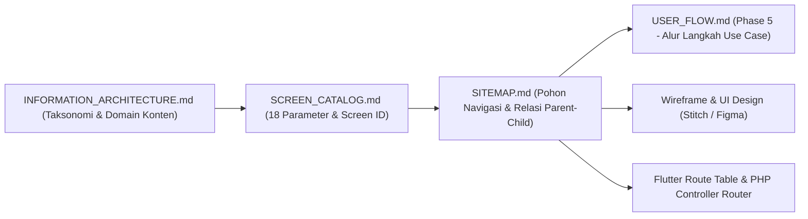
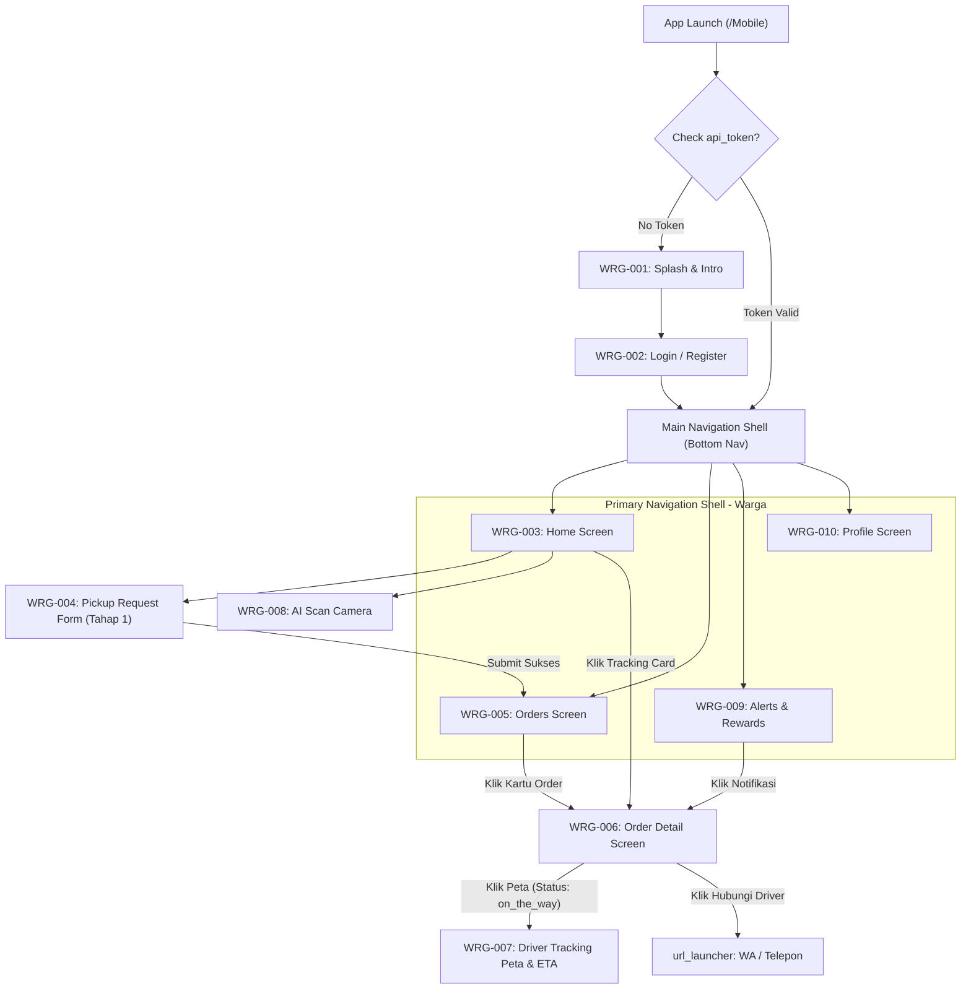
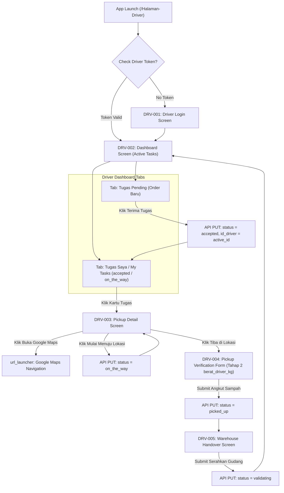
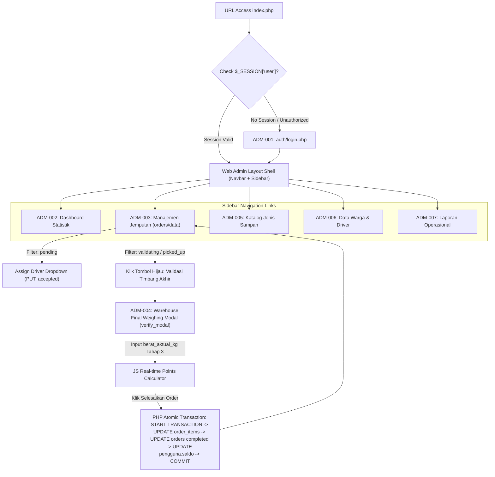

# SITEMAP & NAVIGATION TREE SPECIFICATION (*PHASE 4*)
**Sistem Informasi Bank Sampah Bersinar — Modul Penjemputan Sampah Berbasis Mobile**
*Peta Navigasi, Kedalaman Pohon Halaman, Matriks Relasi Parent-Child, Aturan Akses, dan Mekanisme Transisi Layar*

---

## 1. EXECUTIVE SUMMARY (*Ringkasan Eksekutif*)

Dokumen **Sitemap (`SITEMAP.md`)** ini disusun dalam kapasitas rekayasa arsitektur perangkat lunak (*Enterprise Software Architecture*) sebagai peta struktur pohon navigasi (*Navigation Page Tree*) menyeluruh untuk **Sistem Informasi Bank Sampah Bersinar**.

Berpijak pada spesifikasi 17 kelas layar yang telah dikunci dalam **Screen Catalog (`SCREEN_CATALOG.md`)** dan kerangka organisasi informasi dari **Information Architecture (`INFORMATION_ARCHITECTURE.md`)**, dokumen ini merinci kedalaman navigasi, jalur penelusuran (*Breadcrumb Route*), serta relasi *Parent-Child* untuk ketiga antarmuka sistem: **Aplikasi Mobile Warga (`/Mobile`)**, **Aplikasi Mobile Driver (`/Halaman-Driver`)**, dan **Portal Web Admin (`/bank_sampah`)**.

Sitemap ini merupakan fondasi mutlak yang menjamin bahwa seluruh transisi **6 Status Pesanan** (`pending` → `accepted` → `on_the_way` → `picked_up` → `validating` → `completed`) dan **3 Tahap Penimbangan Muatan** (`estimasi_berat_kg`, `berat_driver_kg`, `berat_aktual_kg`) terhubung secara organis dan terisolasi dengan tepat sesuai peran aktor. Dokumen ini menjadi acuan utama sebelum memasuki **Phase 5: User Flow**, perancangan Wireframe, UI Design (Stitch/Figma), serta pengkodean rute (*Flutter Navigator / Route Table*).

---

## 2. SITEMAP OVERVIEW (*Kedudukan & Hubungan Arsitektural*)

Peta Situs (*Sitemap*) tidak berdiri sendiri, melainkan bertindak sebagai simpul penghubung (*Architectural Bridge*) antara konsep desain fungsional dan implementasi teknis antarmuka:



1. **Hubungan dengan `INFORMATION_ARCHITECTURE.md`**: IA mendefinisikan taksonomi, klasifikasi domain, dan pengelompokan fitur konseptual. Sitemap menerjemahkan kelompok konseptual tersebut menjadi kedalaman hierarki halaman (*Level 0 - Level 3*) yang nyata dan dapat diklik.
2. **Hubungan dengan `SCREEN_CATALOG.md`**: Screen Catalog memberikan identitas spesifik (*Screen ID*: `WRG-***`, `DRV-***`, `ADM-***`) dan spesifikasi 18 parameter untuk setiap layar. Sitemap mengambil seluruh 17 layar dari katalog tersebut untuk dipetakan ke dalam struktur pohon *Parent $\rightarrow$ Child*.
3. **Hubungan dengan `PRD.md`**: Sitemap menjamin bahwa seluruh ruang lingkup bisnis penjemputan sampah (mulai dari registrasi, penimbangan lapangan, tracking rute, hingga validasi gudang) memiliki wadah navigasi fisik yang dapat diakses oleh aktor yang berwenang.
4. **Hubungan dengan *Flutter Navigation & Routing***: Pada implementasi Flutter (`/Mobile` & `/Halaman-Driver`), struktur pohon di Sitemap akan langsung dikonversi menjadi tabel rute (*Named Routes* pada `MaterialApp.routes` atau konfigurasi *GoRouter*), sedangkan pada Web Admin (`/bank_sampah`) dikonversi menjadi skema pengalihan parameter URL (`index.php?page=...`).

---

## 3. SITEMAP MOBILE WARGA (`/Mobile` — Flutter)

Berikut adalah pohon navigasi lengkap (*Hierarchical Tree Diagram*) untuk aplikasi **Mobile Warga (`WRG-***`)**:

```text
[Aplikasi Mobile Warga - Root]
│
├── 1.0 Splash & Onboarding (WRG-001)
│   ├── 1.1 Splash Screen (Auto-check api_token di SharedPreferences)
│   └── 1.2 Splash Intro Screen (3 Slide Panduan Penjemputan Sampah)
│
├── 2.0 Authentication Gate (WRG-002)
│   ├── 2.1 Login Screen (Input Phone/Email & Password)
│   ├── 2.2 Register Screen (Input Data Nasabah Baru & Alamat Domisili)
│   └── 2.3 Forgot Password Series
│       ├── 2.3.1 Request OTP Form
│       ├── 2.3.2 Verification Code Screen (4/6 Digit PinCode)
│       └── 2.3.3 Reset Password Form
│
└── 3.0 Main Navigation Shell (Bottom Navigation Bar 4 Tabs)
    │
    ├── 3.1 TAB 1 : HOME (WRG-003 - Dasbor Utama)
    │   ├── 3.1.1 Hero Card Saldo Poin & Estimasi Nilai Rupiah
    │   ├── 3.1.2 Banner Carousel (Promo & Informasi Bank Sampah)
    │   ├── 3.1.3 Quick Action Grid (Pintu Masuk Cepat Jemput & AI)
    │   ├── 3.1.4 Active Order Alert / Tracking Card (Muncul jika ada order aktif)
    │   └── 3.1.5 Edukasi Article Preview List
    │
    ├── 3.2 TAB 2 : ORDERS / RIWAYAT JEMPUTAN (WRG-005)
    │   ├── 3.2.1 Filter Tab: Semua / Berjalan / Selesai / Dibatalkan
    │   ├── 3.2.2 Order Summary Cards (Nomor #ORD, Alamat, Label 6 Status)
    │   └── 3.2.3 [CHILD LEVEL 2] Order Detail Screen (WRG-006)
    │       ├── 3.2.3.1 Status Timeline Stepper (pending → completed)
    │       ├── 3.2.3.2 Driver Contact Card (Call & WA Buttons)
    │       ├── 3.2.3.3 3-Tier Weighing Audit Table (Estimasi vs Driver vs Aktual)
    │       └── 3.2.3.4 [CHILD LEVEL 3] Driver Tracking Screen (WRG-007 - New)
    │           ├── Peta Realtime Posisi Armada & Rumah Warga
    │           ├── Panel Bottom Sheet Estimasi Waktu Tiba (ETA) & Jarak
    │           └── Action Button: Hubungi Driver
    │
    ├── 3.3 TAB 3 : ALERTS & REWARDS (WRG-009)
    │   ├── 3.3.1 Filter Tab: Semua Notifikasi / Riwayat Poin Masuk
    │   └── 3.3.2 Notification Card Item (Klik mengarahkan ke WRG-006)
    │
    ├── 3.4 TAB 4 : PROFILE & SETTINGS (WRG-010)
    │   ├── 3.4.1 User Info Card (Foto Avatar, Nama Lengkap, No. Telepon)
    │   ├── 3.4.2 Ubah Data Profil Form (Modal/Sub-page)
    │   ├── 3.4.3 Pengaturan Alamat Jemput Default (Sub-page)
    │   ├── 3.4.4 FAQ & Bantuan Pengguna
    │   └── 3.4.5 Logout Confirmation Dialog (Clears SharedPreferences)
    │
    └── 3.5 [SECONDARY MODULES - Accessed via Home / Quick Actions]
        ├── 3.5.1 Pickup Request Form (WRG-004 - Tahap 1 estimasi_berat_kg)
        │   ├── Pilihan Alamat Jemput & Peta Titik Koordinat
        │   ├── Pemilihan Tanggal & Sesi Waktu (Pagi/Siang)
        │   ├── Input Dynamic Items (Kategori Sampah + estimasi_berat_kg)
        │   ├── Kalkulator Real-time Estimasi Poin & Catatan Driver
        │   └── Submit Confirmation Dialog (Redirect to WRG-005 / WRG-006)
        │
        └── 3.5.2 AI Scan & Education Module (WRG-008)
            ├── Camera Viewfinder & Image Capture Shutter
            ├── ML Classification Modal Sheet (Hasil Deteksi & Estimasi Poin)
            └── Katalog Edukasi Daur Ulang (Daftar Artikel & Detail View)
```

---

### Bagan Navigasi Mobile Warga (`/Mobile`)


---

## 4. SITEMAP MOBILE DRIVER (`/Halaman-Driver` — Flutter)

Berikut adalah pohon navigasi untuk aplikasi **Mobile Driver (`DRV-***`)**:

```text
[Aplikasi Mobile Driver - Root]
│
├── 1.0 Driver Authentication Gate (DRV-001)
│   ├── 1.1 Splash Screen Driver (Check SharedPreferences Driver Token)
│   └── 1.2 Driver Login Screen (Input Username/Phone & Password Khusus Armada)
│
└── 2.0 Dashboard & Operations Command Center (DRV-002)
    │
    ├── 2.1 DASHBOARD TUGAS OPERASIONAL (DRV-002 - Main Screen)
    │   ├── 2.1.1 Header Armada & Toggle Switch Ketersediaan (Ready / Online)
    │   ├── 2.1.2 Tab "Tugas Pending" (Daftar Order Baru Siap Jemput di Wilayah)
    │   │   └── Aksi Kartu: Tombol "Terima Tugas" (status → accepted)
    │   │
    │   └── 2.1.3 Tab "Tugas Saya / My Tasks" (Daftar Order accepted / on_the_way)
    │       └── Aksi Kartu: Klik untuk Masuk ke Detail Tugas (DRV-003)
    │
    ├── 2.2 PICKUP EXECUTION WORKFLOW (Sub-tree Penanganan Tugas)
    │   ├── 2.2.1 Pickup Detail Screen (DRV-003)
    │   │   ├── Customer Contact Box (Nama, Telepon, Tombol Call/WA Langsung)
    │   │   ├── Peta Lokasi Rumah & Tombol "Buka Google Maps" (External Launcher)
    │   │   ├── Rincian Item Estimasi Warga (estimasi_berat_kg - Tahap 1)
    │   │   ├── Dynamic Action: Tombol "Mulai Menuju Lokasi (`on_the_way`)"
    │   │   └── Dynamic Action: Tombol "Tiba di Lokasi (Mulai Penimbangan)"
    │   │
    │   ├── 2.2.2 [CHILD LEVEL 2] Pickup Verification Screen (DRV-004 - Tahap 2)
    │   │   ├── Form Dynamic Input Berat Driver (`berat_driver_kg`) per Item
    │   │   ├── Kamera Pengambilan Foto Bukti Tumpukan Sampah
    │   │   ├── TextFormField Catatan Lapangan Driver
    │   │   └── Submit Action: Tombol "Konfirmasi Angkut Sampah (`picked_up`)"
    │   │
    │   └── 2.2.3 [CHILD LEVEL 3] Warehouse Handover Screen (DRV-005 - New)
    │       ├── Ringkasan Muatan yang Dibawa (Total berat_driver_kg)
    │       ├── Rincian Gudang Tujuan & Nama Petugas Verifikator
    │       ├── Checkbox Konfirmasi Serah Terima Muatan Fisik
    │       └── Submit Action: Tombol "Serahkan Muatan ke Gudang (`validating`)"
    │
    ├── 2.3 SCHEDULE & HISTORY MODULES (DRV-006)
    │   ├── 2.3.1 Tab Jadwal Penjemputan Mendatang (Filter by Date)
    │   └── 2.3.2 Tab Riwayat Penjemputan Selesai (Daftar Order validating / completed)
    │
    └── 2.4 ALERTS & PROFILE MODULES (DRV-007)
        ├── 2.4.1 Alerts List (Notifikasi Penugasan & Pembatalan)
        └── 2.4.2 Driver Profile & Vehicle Specification Card (Plat, Tipe, Kapasitas KG)
            └── Logout Confirmation Dialog
```

---

### Bagan Navigasi Mobile Driver (`/Halaman-Driver`)


---

## 5. SITEMAP WEB ADMIN (`/bank_sampah` — PHP Native Prosedural)

Berikut adalah pohon struktur halaman dan router controller pada **Portal Web Admin (`ADM-***`)**:

```text
[Portal Web Admin - Root (index.php Controller)]
│
├── 1.0 Admin Authentication Gate (ADM-001)
│   ├── 1.1 Login Page (`auth/login.php` - Input Username & Password)
│   └── 1.2 Session Controller (`check_session.php` - Otorisasi level = 'admin'/'petugas')
│
└── 2.0 Admin Dashboard & Modules Shell (Navbar + Sidebar Navigation)
    │
    ├── 2.1 EXECUTIVE DASHBOARD (ADM-002 - `index.php?page=dashboard`)
    │   ├── 2.1.1 4 Stat Boxes (Total Warga, Total Driver, Order Aktif, Poin Sah)
    │   ├── 2.1.2 Grafik Tren Sampah Bulanan (Chart.js / ApexCharts)
    │   └── 2.1.3 Tabel Ringkas 5 Pesanan Terbaru Siap Validasi
    │
    ├── 2.2 ORDERS MANAGEMENT MODULE (ADM-003 - `index.php?page=orders`)
    │   ├── 2.2.1 Status Filter Tabs (Semua / pending / accepted / on_the_way / picked_up / validating / completed)
    │   ├── 2.2.2 DataTables List (Cari ID Order, Nama Warga, Nama Driver)
    │   ├── 2.2.3 [SUB-COMPONENT] Manual Driver Assign Dropdown (Khusus baris status pending)
    │   └── 2.2.4 [CHILD LEVEL 2 MODAL] Warehouse Final Weighing Modal (ADM-004 - `verify_modal.php`)
    │       ├── Rincian Audit Jemputan (ID, Warga, Driver Pengangkut)
    │       ├── 3-Tier Weighing Comparison Table (Item | Estimasi Warga KG | Berat Driver KG)
    │       ├── Form Dynamic Input Berat Aktual Gudang (`berat_aktual_kg` - Tahap 3)
    │       ├── Real-time JS Points Calculator Display (`berat_aktual_kg` * harga_poin)
    │       ├── Textarea Catatan Inspeksi & Potongan Kualitas Sampah
    │       └── Submit Action: Eksekusi Transaksi Atomic ACID (`BEGIN TRANSACTION` → completed)
    │
    ├── 2.3 MASTER DATA CATALOG (ADM-005 - `index.php?page=jenis_sampah`)
    │   ├── 2.3.1 Tabel Katalog Jenis Sampah (Nama, Satuan, Harga Poin/KG)
    │   └── 2.3.2 Modal Form CRUD Tambah / Edit Harga Poin per KG
    │
    ├── 2.4 USERS & DRIVERS MANAGEMENT (ADM-006)
    │   ├── 2.4.1 Manajemen Data Warga (`index.php?page=warga` - Tabel Nasabah & Saldo Poin)
    │   └── 2.4.2 Manajemen Data Driver (`index.php?page=driver` - Tabel & Spesifikasi Truk/Plat)
    │
    └── 2.5 EDUCATION & OPERATIONAL REPORTS (ADM-007)
        ├── 2.5.1 Manajemen Edukasi (`index.php?page=edukasi` - CRUD Artikel Lingkungan)
        └── 2.5.2 Rekapitulasi Laporan (`index.php?page=laporan`)
            ├── Filter Rentang Tanggal (Dari Tanggal - Sampai Tanggal)
            ├── Filter Jenis Sampah / Wilayah
            └── Export Action: Cetak Laporan Resmi PDF / Excel untuk Lampiran TA
```

---

### Bagan Navigasi Web Admin (`/bank_sampah`)


---

## 6. NAVIGATION MATRIX (*Matriks Relasi & Kesiapan Layar*)

Berikut adalah matriks relasi navigasi *Parent-Child* yang mengkatalogkan secara presisi seluruh 17 kelas layar/modul pada sistem kita sesuai ketetapan `SCREEN_CATALOG.md`:

| Screen ID | Screen Name | Parent Screen | Child Screen / Modal | Role / Aktor | Priority | Existing Status |
| :---: | :--- | :--- | :--- | :--- | :---: | :---: |
| **WRG-001** | `Splash & Intro Screen` | *App Root* | `LoginScreen (WRG-002)` / `HomeScreen` | Warga | Low | **Existing** |
| **WRG-002** | `Authentication Screens` | `SplashScreen (WRG-001)`| `HomeScreen (WRG-003)` | Warga | High | **Existing** |
| **WRG-003** | `Home Screen` (Tab 1) | `MainNavigationShell` | `PickupRequest (WRG-004)`, `Scan (WRG-008)` | Warga | High | **Existing** |
| **WRG-004** | `Pickup Request Screen` | `HomeScreen (WRG-003)` | *Dialog Konfirmasi Submit* $\rightarrow$ `Orders (WRG-005)` | Warga | **Critical** | **Existing** |
| **WRG-005** | `Orders Screen` (Tab 2) | `MainNavigationShell` | `OrderDetailScreen (WRG-006)` | Warga | High | **Need Revision** |
| **WRG-006** | `Order Detail Screen` | `OrdersScreen (WRG-005)`| `DriverTrackingScreen (WRG-007)` | Warga | **Critical** | **Need Revision** |
| **WRG-007** | `Driver Tracking Screen` | `OrderDetailScreen (WRG-006)`| *Call/WA External Launcher* | Warga | Medium | **New Screen** |
| **WRG-008** | `AI Scan & Education` | `HomeScreen (WRG-003)` | *ML Classification Bottom Sheet* | Warga | Low | **Existing** |
| **WRG-009** | `Alerts & Reward` (Tab 3)| `MainNavigationShell` | `OrderDetailScreen (WRG-006)` | Warga | High | **Need Revision** |
| **WRG-010** | `Profile Screen` (Tab 4) | `MainNavigationShell` | *Ubah Profil Modal / Logout Dialog* | Warga | Medium | **Existing** |
| **DRV-001** | `Driver Auth Screens` | *Driver App Root* | `DashboardScreen (DRV-002)` | Driver | High | **Existing** |
| **DRV-002** | `Dashboard Screen` | `DriverAuth (DRV-001)` | `PickupDetailScreen (DRV-003)` | Driver | **Critical** | **Existing** |
| **DRV-003** | `Pickup Detail Screen` | `DashboardScreen (DRV-002)`| `PickupVerification (DRV-004)` / Google Maps | Driver | High | **Existing** |
| **DRV-004** | `Pickup Verification` | `PickupDetailScreen (DRV-003)`| `WarehouseHandoverScreen (DRV-005)` | Driver | **Critical** | **Need Revision** |
| **DRV-005** | `Warehouse Handover` | `PickupVerification (DRV-004)`| *Dialog Sukses Serah Gudang* $\rightarrow$ `DRV-002` | Driver | **Critical** | **New Screen** |
| **DRV-006** | `Schedule & History` | `DashboardScreen (DRV-002)`| `PickupDetailScreen (DRV-003)` (Read-only) | Driver | Medium | **Existing** |
| **DRV-007** | `Alerts & Profile` | `DashboardScreen (DRV-002)`| *Logout Confirmation Dialog* | Driver | Low | **Existing** |
| **ADM-001** | `Admin Login Page` | *Web Admin Root* | `ExecutiveDashboard (ADM-002)` | Web Admin | High | **Existing** |
| **ADM-002** | `Executive Dashboard` | `AdminNavbar / Sidebar` | `OrdersManagementTable (ADM-003)` | Web Admin | Medium | **Existing** |
| **ADM-003** | `Orders Management Table`| `Sidebar Menu` | `WarehouseWeighingModal (ADM-004)` | Web Admin | **Critical** | **Need Revision** |
| **ADM-004** | `Warehouse Final Modal` | `OrdersTable (ADM-003)` | *ACID Execution Redirect* $\rightarrow$ `ADM-003` | Web Admin | **Critical** | **New Component** |
| **ADM-005** | `Waste Catalog Management`| `Sidebar Menu` | *Modal CRUD Harga Poin/KG* | Web Admin | High | **Existing** |
| **ADM-006** | `Users & Drivers Data` | `Sidebar Menu` | *Modal CRUD Akun & Spesifikasi Truk* | Web Admin | Medium | **Existing** |
| **ADM-007** | `Education & Reports` | `Sidebar Menu` | *Print Preview Window / Excel Downloader* | Web Admin | Medium | **Existing** |

---

## 7. NAVIGATION RULES (*Aturan Kritis Navigasi & Kondisi Status*)

Agar sistem tidak dapat dimanipulasi (*Tamper-Proof Navigation*), setiap perpindahan layar dipagari oleh 5 (lima) aturan bersyarat yang ketat:

### 1. Aturan Navigasi Peta Tracking (`WRG-007 DriverTrackingScreen`)
- **Syarat Mutlak (`on_the_way`)**: Tombol **"Lihat Peta Realtime & ETA"** di layar `WRG-006 (OrderDetailScreen)` **HANYA AKTIF dan dapat diklik jika dan hanya jika status order == `'on_the_way'`**.
- **Penutupan Akses**: Jika status masih `pending` / `accepted`, atau jika sudah beralih ke `picked_up` / `validating` / `completed`, tombol tracking disembunyikan (*hidden*) atau dinonaktifkan (*disabled*) karena posisi armada sudah tidak relevan bagi warga.

### 2. Aturan Navigasi Verifikasi & Serah Gudang Driver (`DRV-004` $\rightarrow$ `DRV-005`)
- **Penguncian Urutan**: Driver tidak dapat mengakses `DRV-004 (PickupVerificationScreen)` sebelum menekan tombol *"Tiba di Lokasi"* yang mensyaratkan status aktif `on_the_way`.
- **Transisi `picked_up` ke `validating`**: Layar `DRV-005 (WarehouseHandoverScreen)` hanya dapat dibuka dari order yang telah melewati tahap input `berat_driver_kg` (`DRV-004`). Setelah driver menekan tombol *"Serahkan Muatan ke Gudang"*, status berubah menjadi `validating`, dan order tersebut **hilang seketika dari navigasi aktif driver** untuk mencegah modifikasi ganda.

### 3. Aturan Navigasi Modal Timbang Gudang (`ADM-004 orders/verify_modal`)
- **Syarat Mutlak (`validating` atau `picked_up`)**: Tombol aksi hijau tajam **"Validasi Timbang Akhir"** pada tabel `ADM-003` hanya dimunculkan pada baris order yang berstatus `validating` (atau `picked_up`). Baris berstatus `completed` atau `cancelled` dikunci menjadi mode *Read-Only*.

### 4. Aturan Navigasi Transparansi Reward Poin Sah
- **Penguncian Informasi Poin**: Kolom *Berat Aktual Final (`berat_aktual_kg` - Tahap 3)* dan *Poin Sah* pada layar `WRG-006 (OrderDetailScreen)` maupun `WRG-009 (RewardHistoryScreen)` **HANYA DITAMPILKAN SETELAH status order == `'completed'`**. Selama status masih `pending` hingga `validating`, antarmuka warga hanya menampilkan angka `estimasi_berat_kg` dan memberi label *"Poin sedang dihitung gudang"*.

### 5. Aturan Navigasi Pembatalan Order (`cancelled`)
- Tombol **"Batalkan Jemputan"** di `WRG-006` atau `ADM-003` hanya diizinkan diakses ketika status == `'pending'` atau `'accepted'`. Setelah armada berstatus `on_the_way` atau lebih, jalur navigasi pembatalan ditutup secara permanen oleh sistem.

---

## 8. DEEP NAVIGATION (*Alur Navigasi Level Terdalam*)

Berikut adalah simulasi jejak penelusuran (*Breadcrumb Trail*) untuk mencapai halaman/komponen level terdalam (*Deepest Child Level 3*) pada setiap peran:

### A. Deep Navigation Warga (Mencapai Peta Tracking Realtime & Kontak Driver)
$$\text{App Launch} \longrightarrow \text{Tab 2: Orders (WRG-005)} \longrightarrow \text{Klik Kartu Order `on\_the\_way`}$$
$$\longrightarrow \text{Order Detail Level 2 (WRG-006)} \longrightarrow \text{Klik Tombol "Lihat Peta Realtime"}$$
$$\longrightarrow \mathbf{\text{Driver Tracking Level 3 (WRG-007)}} \longrightarrow \text{Klik Tombol Call/WA Driver (External Launcher)}$$
- *Kedalaman Navigasi*: **4 Tingkat dari Root**.

### B. Deep Navigation Driver (Mencapai Serah Terima Muatan Gudang)
$$\text{Dashboard (DRV-002)} \longrightarrow \text{Tab My Tasks} \longrightarrow \text{Klik Kartu Tugas `on\_the\_way`}$$
$$\longrightarrow \text{Pickup Detail Level 1 (DRV-003)} \longrightarrow \text{Klik Tombol "Tiba di Lokasi"}$$
$$\longrightarrow \text{Pickup Verification Level 2 (DRV-004 — Input Tahap 2 berat\_driver\_kg)}$$
$$\longrightarrow \text{Klik Konfirmasi Angkut (`picked\_up`)} \longrightarrow \mathbf{\text{Warehouse Handover Level 3 (DRV-005)}}$$
- *Kedalaman Navigasi*: **4 Tingkat dari Dasbor**.

### C. Deep Navigation Web Admin (Mencapai Eksekusi Atomic ACID Transaction)
$$\text{Login Page (ADM-001)} \longrightarrow \text{Sidebar Menu "Data Penjemputan" (ADM-003)}$$
$$\longrightarrow \text{Klik Filter Tab Status `validating`} \longrightarrow \text{Klik Tombol Hijau "Validasi Timbang Akhir"}$$
$$\longrightarrow \mathbf{\text{Modal Timbang Final Level 2 (ADM-004 — Input Tahap 3 berat\_aktual\_kg)}}$$
$$\longrightarrow \text{Kalkulasi JS Real-time} \longrightarrow \text{Klik "Selesaikan Order \& Salurkan Poin" (ACID Execution)}$$
- *Kedalaman Navigasi*: **3 Tingkat dari Root Portal**.

---

## 9. SCREEN ACCESSIBILITY (*Hak Akses & Isolasi Peran*)

Untuk menjaga keamanan data antarmuka (*Role-Based Access Control / RBAC*), peta navigasi menerapkan pemisahan batas akses mutlak:

| Screen ID Group | Hak Akses Otoritatif | Larangan / Isolasi Akses | Penanganan Pengalihan Jika Melanggar |
| :--- | :--- | :--- | :--- |
| **`WRG-***` (Warga)** | Akun dengan `level = 'warga'` dan memiliki `api_token` aktif di SharedPreferences. | Driver (`level = 'driver'`) dan Petugas Admin dilarang mengakses antarmuka mobile Warga. | Sistem langsung menampilkan *Dialog Access Denied* dan memaksa *Logout* / keluar ke `WRG-002`. |
| **`DRV-***` (Driver)** | Akun khusus armada yang terverifikasi di database dengan `level = 'driver'`. | Warga biasa (`level = 'warga'`) dilarang keras login atau mengakses `DRV-002` hingga `DRV-007`. | Snackbar merah *"Akses Ditolak: Akun Anda bukan Armada Driver Bank Sampah"* di layar login `DRV-001`. |
| **`ADM-***` (Web Admin)**| Sesi PHP aktif (`$_SESSION['user']`) dengan `level IN ('admin', 'petugas')`. | Warga maupun Driver dilarang membuka URL portal web admin `index.php?page=...`. | Router `check_session.php` menghentikan eksekusi skrip dan mengalihkan paksa (`header('Location: auth/login.php')`). |

---

## 10. SCREEN TRANSITION (*Mekanisme Perpindahan Layar*)

Penyajian antarmuka pada navigasi mobile dan web dikategorikan dalam 5 (lima) tipe transisi visual:

1. **Forward Route (`Navigator.push` / `GoRouter.go`)**:
   - Transisi maju dari halaman induk ke halaman anak (contoh: dari `OrdersScreen` ke `OrderDetailScreen`). Pada Flutter, transisi ini memuat animasi geser horizontal standar (*Slide Right-to-Left* pada Android/iOS) dan menambahkan rute ke dalam tumpukan (*Route Stack*).
2. **Back Route (`Navigator.pop` / `Header Back Button`)**:
   - Transisi kembali ke layar induk dengan menghapus rute teratas dari tumpukan (*Stack Pop*). Tombol anak panah kiri (*Back Arrow*) di *AppBar* secara otomatis dipetakan ke aksi ini.
3. **Modal Dialog (`showDialog` / Bootstrap Modal)**:
   - Jendela melayang di tengah layar dengan latar belakang gelap transparan (*Overlay Dimming*). Digunakan untuk aksi kritis yang memerlukan fokus penuh, seperti **Modal Timbang Final Gudang (`ADM-004`)**, *Logout Confirmation Dialog*, atau *Alert Dialog Error*.
4. **Bottom Sheet (`showModalBottomSheet`)**:
   - Panel melayang yang muncul dari dasar layar ke atas. Sangat efektif untuk menampilkan **Kalkulator Klasifikasi AI (`WRG-008`)** dan panel ringkasan ETA/Jarak pada layar peta **Driver Tracking (`WRG-007`)**.
5. **External App Launcher (`url_launcher`)**:
   - Pengalihan navigasi keluar dari aplikasi menuju aplikasi native sistem operasi eksternal. Digunakan oleh `DRV-003` saat menekan tombol **"Buka Google Maps"** (`google.navigation:q=lat,long`) serta tombol **Call / WhatsApp Driver** di `WRG-006` dan `WRG-007`.

---

## 11. FUTURE EXPANSION (*Penambahan Halaman Masa Depan*)

Untuk membuktikan keunggulan prinsip *Scalability*, Sitemap ini telah menyiapkan 4 titik sambungan cabang (*Expansion Slots*) untuk pengembangan modul lanjutan pasca-Tugas Akhir:

```text
[Main Navigation Shell / Sidebar Expansion Slots]
│
├── [Slot Masa Depan 1] VOUCHER & REDEEM CATALOG (`WRG-011`)
│   └── Cabang baru dari Tab `Home` / `Rewards` untuk menukarkan saldo poin dengan voucher pulsa, token listrik, atau sembako.
│
├── [Slot Masa Depan 2] LIVE CHAT DRIVER-WARGA (`WRG-012` & `DRV-008`)
│   └── Integrasi ruang obrolan langsung berbasis WebSocket/Firebase di dalam layar `OrderDetailScreen (WRG-006)` dan `PickupDetailScreen (DRV-003)`.
│
├── [Slot Masa Depan 3] GAMIFICATION & LEADERBOARD (`WRG-013`)
│   └── Peringkat warga paling rajin memilah sampah dan koleksi lencana peduli lingkungan di Tab 1 (`HomeScreen`).
│
└── [Slot Masa Depan 4] EXTERNAL E-WALLET CASH OUT (`WRG-014` & `ADM-008`)
    └── Modul pencairan saldo poin menjadi uang tunai langsung ke rekening bank atau domisili digital (Gopay/OVO/Dana) melalui verifikasi API perbankan.
```

---

## 12. GAP ANALYSIS & VERIFIKASI KONSISTENSI (*SSOT Alignment Verification*)

Pemeriksaan silang (*Cross-Verification Audit*) antara **`SITEMAP.md`** dengan seluruh dokumen *Single Source of Truth* sebelumnya menunjukkan **keselarasan 100% tanpa ada satu pun layar atau aturan yang hilang (*Zero Missing Screens*)**:

| Dokumen Sumber SSOT | Parameter Verifikasi dalam Sitemap | Status Verifikasi | Catatan Audit Konsistensi |
| :--- | :--- | :---: | :--- |
| **`MASTER_PROJECT_PLAN.md`** | Pemanfaatan arsitektur hibrid Flutter (`/Mobile`, `/Halaman-Driver`) dan PHP Native (`/bank_sampah`). | **100% Sesuai** | Struktur pohon terbagi tegas dalam 3 antarmuka sesuai roadmap Phase 4. |
| **`FEATURE_INVENTORY.md`** | Pemetaan 9 fitur enhancement (termasuk `DriverTrackingScreen` dan `WarehouseHandoverScreen`). | **100% Sesuai** | Seluruh fitur baru telah menempati koordinat hierarki yang tepat pada pohon navigasi. |
| **`CONTENT_INVENTORY.md`** | Ketergantungan data koordinat latar belakang dan kueri Atomic ACID pada modal verifikasi akhir. | **100% Sesuai** | Aturan navigasi Bab 7 mengunci ketergantungan tampilan informasi sesuai kesepakatan spesifikasi konten. |
| **`INFORMATION_ARCHITECTURE.md`**| Pengelompokan 6 domain taksonomi & 3 tingkatan navigasi (*Primary, Secondary, Contextual*). | **100% Sesuai** | Matriks navigasi Bab 6 mengadopsi penuh pembagian tingkatan IA dari Level 0 hingga Level 3. |
| **`SCREEN_CATALOG.md`** | Kelengkapan 17 Screen ID (`WRG-001` hingga `ADM-007`) bersertakan status *Existing, Need Revision, New Screen*. | **100% Sesuai** | Ke-17 layar/modul katalog tercatat tanpa kecuali pada matriks dan pohon bagan. |

---

## 13. REKOMENDASI MENUJU PHASE 5 (`USER_FLOW.md`)

Dengan rampungnya **PHASE 4: Sitemap (`SITEMAP.md`)**, kita telah memiliki peta jalan antarmuka yang sangat presisi. Sebelum melangkah ke **PHASE 5: User Flow**, berikut adalah 3 rekomendasi teknis yang harus dipersiapkan:

1. **Gunakan Kedalaman Navigasi Sitemap sebagai Kerangka Diagram Alur (*Activity/Flowchart*)**: Pada penyusunan dokumen `USER_FLOW.md` berikutnya, setiap transisi dari *Parent Screen* $\rightarrow$ *Child Screen* $\rightarrow$ *Modal/API Action* yang kita petakan di dokumen ini harus dikonversi menjadi kotak proses (*Flow Node*) berurutan.
2. **Pisahkan User Flow Menjadi 4 Skenario Use Case Utama**: Agar tidak rumit dan mudah dipahami dalam bab perancangan Tugas Akhir, `USER_FLOW.md` disarankan memuat 4 diagram alur terpisah:
   - *User Flow 1: Pengajuan Jemputan oleh Warga (Tahap 1 estimasi_berat_kg → status pending)*
   - *User Flow 2: Penerimaan & Penjemputan Lapangan oleh Driver (status accepted → on_the_way → Tahap 2 berat_driver_kg → picked_up)*
   - *User Flow 3: Pemantauan & Tracking Realtime oleh Warga (status on_the_way)*
   - *User Flow 4: Verifikasi & Timbang Akhir Gudang oleh Web Admin (status validating → Tahap 3 berat_aktual_kg → Atomic ACID Transaction → status completed)*
3. **Sertakan Jalur Penanganan Kesalahan (*Error/Exception Paths*) pada User Flow**: Selain jalur sukses normal (*Happy Path*), `USER_FLOW.md` wajib memetakan jalur pembatalan order (`cancelled`) dan penanganan rollback transaksi jika terjadi gangguan koneksi pada saat validasi gudang.

---
*Dokumen SITEMAP.md ini mengacu penuh pada MASTER_PROJECT_PLAN.md, FEATURE_INVENTORY.md, CONTENT_INVENTORY.md, INFORMATION_ARCHITECTURE.md, dan SCREEN_CATALOG.md sebagai Single Source of Truth (SSOT).*
