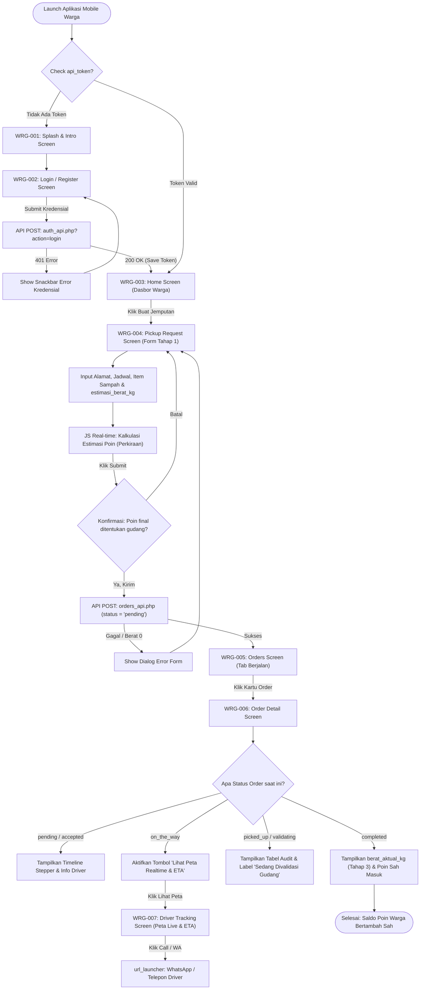
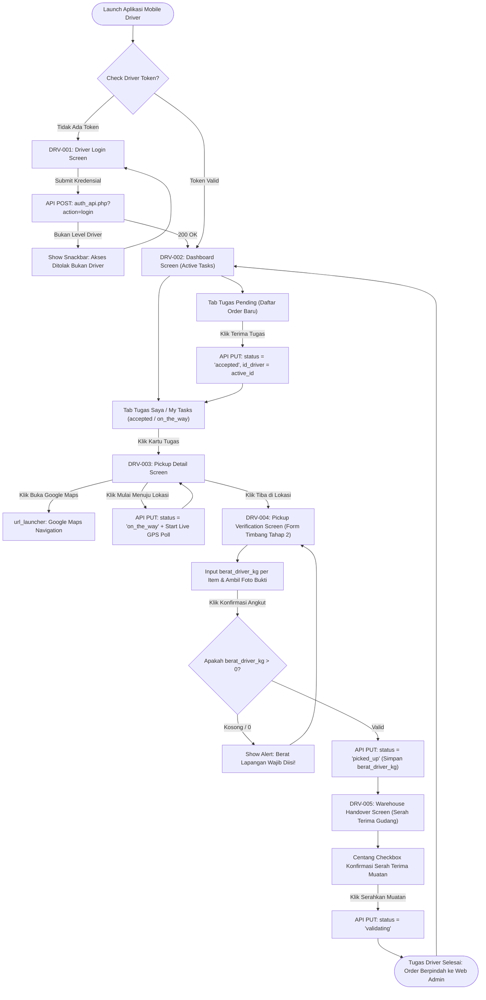
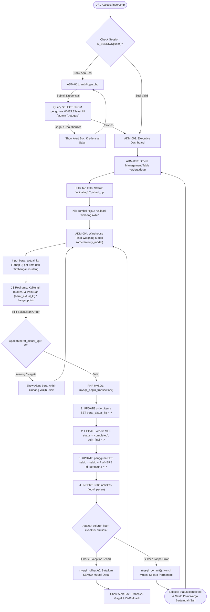
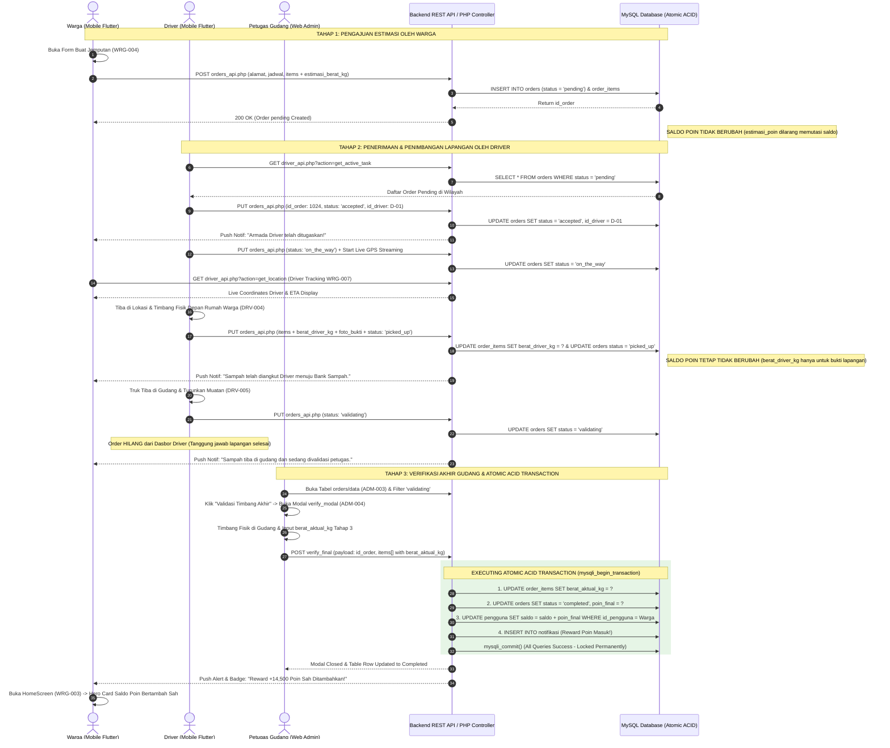
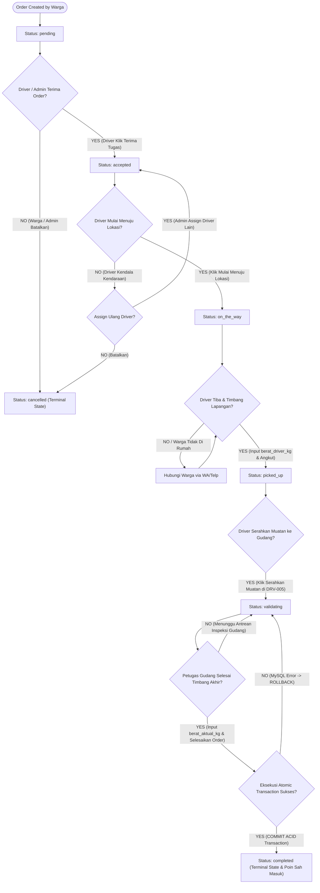

# USER FLOW SPECIFICATION & INTERACTION JOURNEY (*PHASE 5*)
**Sistem Informasi Bank Sampah Bersinar — Modul Penjemputan Sampah Berbasis Mobile**
*Alur Langkah Interaksi Pengguna, Transisi Status Pesanan, Rantai Data Lintas Aktor, dan Penanganan Skenario Kesalahan*

---

## 1. EXECUTIVE SUMMARY (*Ringkasan Eksekutif*)

Dokumen **User Flow (`USER_FLOW.md`)** ini disusun dalam kapasitas rekayasa arsitektur perangkat lunak (*Enterprise Software Architecture*) sebagai dokumen *Single Source of Truth (SSOT)* yang merinci setiap langkah interaksi, alur pengambilan keputusan (*Decision Logic*), serta transisi status yang dialami oleh 3 (tiga) aktor utama sistem: **Warga**, **Driver**, dan **Petugas Bank Sampah (Web Admin)**.

Berpijak pada struktur informasi dari **Information Architecture (`INFORMATION_ARCHITECTURE.md`)**, spesifikasi 18 parameter di **Screen Catalog (`SCREEN_CATALOG.md`)**, dan kedalaman pohon rute di **Sitemap (`SITEMAP.md`)**, dokumen User Flow ini mengonversi susunan antarmuka statis menjadi **alur interaksi dinamis (*Step-by-Step User Journey*)**. 

Mengapa User Flow mutlak diperlukan sebelum memasuki tahap rancangan Wireframe, Design System, UI Stitch, dan Figma?
1. **Menghilangkan Titik Buntu (*Dead-Ends Elimination*)**: Memastikan tidak ada satu pun layar atau aksi pengguna yang berujung tanpa kejelasan navigasi atau tanpa balikan status (*System Feedback*).
2. **Mengamankan Logika 6 Status dan 3 Tahap Berat**: Menjamin bahwa setiap transisi status (`pending` → `accepted` → `on_the_way` → `picked_up` → `validating` → `completed`) dan penimbangan muatan (`estimasi_berat_kg` → `berat_driver_kg` → `berat_aktual_kg`) memiliki pemicu (*trigger*) pasti, validasi masukan, dan pengalihan rute yang tepat.
3. **Standarisasi Penanganan Kesalahan (*Error Resilience*)**: Menentukan respons sistem ketika terjadi kondisi abnormal seperti gangguan jaringan, penolakan order, atau kegagalan transaksi database (*Atomic ACID Rollback*), sehingga desainer UI dapat merancang state error yang informatif.

---

## 2. USER FLOW OVERVIEW (*Ikhtisar Alur Utama Sistem*)

Berikut adalah tabel matriks ikhtisar seluruh alur interaksi utama yang terjadi di dalam **Sistem Informasi Bank Sampah Bersinar**:

| Flow ID | Flow Name | Aktor Utama | Tujuan Alur (*Goal*) | Start Screen | End Screen |
| :---: | :--- | :--- | :--- | :---: | :---: |
| **UF-WRG-01** | `Warga Authentication` | Warga | Masuk atau mendaftarkan akun nasabah baru secara aman. | `WRG-001 (Splash)` | `WRG-003 (HomeScreen)` |
| **UF-WRG-02** | `Pickup Request Submission` | Warga | Mengajukan jemputan sampah (Tahap 1 `estimasi_berat_kg`). | `WRG-003 (HomeScreen)` | `WRG-005 (OrdersScreen)` |
| **UF-WRG-03** | `Realtime Driver Tracking` | Warga | Memantau koordinat live armada & ETA saat `on_the_way`. | `WRG-006 (OrderDetail)` | `WRG-007 (DriverTracking)` |
| **UF-WRG-04** | `AI Scan & Education Read` | Warga | Mengidentifikasi jenis sampah dengan AI & membaca artikel. | `WRG-003 (HomeScreen)` | `WRG-008 (Scan/Education)`|
| **UF-WRG-05** | `Order History & Reward View`| Warga | Memeriksa riwayat penjemputan & pertambahan saldo poin sah. | `WRG-003 (HomeScreen)` | `WRG-006 (OrderDetail)` |
| **UF-DRV-01** | `Driver Authentication` | Driver | Login kredensial armada penjemput resmi. | `DRV-001 (DriverLogin)` | `DRV-002 (Dashboard)` |
| **UF-DRV-02** | `Task Acceptance & Navigation`| Driver | Menerima order `pending` ($\rightarrow$ `accepted`) & menuju lokasi (`on_the_way`).| `DRV-002 (Dashboard)` | `DRV-003 (PickupDetail)` |
| **UF-DRV-03** | `Pickup Field Verification` | Driver | Input timbang lapangan (Tahap 2 `berat_driver_kg` $\rightarrow$ `picked_up`).| `DRV-003 (PickupDetail)` | `DRV-004 (PickupVerify)` |
| **UF-DRV-04** | `Warehouse Handover` | Driver | Serah terima muatan di gudang ($\rightarrow$ `validating`). | `DRV-004 (PickupVerify)` | `DRV-005 (Handover)` $\rightarrow$ `DRV-002` |
| **UF-ADM-01** | `Admin Portal Authentication` | Web Admin | Login aman ke portal pengelolaan Bank Sampah. | `ADM-001 (auth/login)` | `ADM-002 (Dashboard)` |
| **UF-ADM-02** | `Manual Driver Assignment` | Web Admin | Memasangkan armada ke order berstatus `pending`. | `ADM-003 (orders/data)` | `ADM-003 (orders/data)` |
| **UF-ADM-03** | `Warehouse Final Verification & ACID Completion` | Web Admin | Timbang akhir gudang (Tahap 3 `berat_aktual_kg`), kalkulasi poin sah, & transaksi ACID (`completed`). | `ADM-003 (orders/data)` | `ADM-004 (verify_modal)` $\rightarrow$ `ADM-003` |

---

## 3. USER FLOW WARGA (`UF-WRG-***` — Aplikasi Mobile Flutter)

### A. Skenario Detail Alur Warga

#### UF-WRG-01 : Alur Login & Registrasi Warga
- **Tujuan**: Memastikan identitas warga valid dan menerbitkan token sesi (`api_token`).
- **Trigger**: Warga membuka aplikasi atau menekan tombol Masuk/Daftar.
- **Preconditions**: Aplikasi terpasang dan terhubung ke server `192.168.31.220`.
- **Main Flow (Langkah Normal)**:
  1. Warga membuka aplikasi $\rightarrow$ sistem memuat `WRG-001 (SplashScreen)`.
  2. Sistem memeriksa `api_token` di `SharedPreferences`. Jika tidak ada, sistem mengarahkan ke `WRG-002 (LoginScreen)`.
  3. Warga memasukkan Nomor Telepon dan Kata Sandi, lalu menekan *"Masuk"*.
  4. Aplikasi mengirim POST request ke `auth_api.php?action=login`.
  5. Server memvalidasi kredensial, mencocokkan `level = 'warga'`, dan merespons `200 OK` berserta `api_token`.
  6. Aplikasi menyimpan token ke `SharedPreferences` dan menavigasi rute *Forward* ke `WRG-003 (HomeScreen)`.
- **Alternate Flow (Registrasi Akun Baru)**:
  - Di langkah 2, warga memilih *"Daftar Akun Baru"*. Sistem membuka `RegisterScreen`. Warga melengkapi Nama, Telepon, Kata Sandi, dan Alamat Domisili, lalu klik *"Daftar"*. Server menyimpan ke tabel `pengguna` dan langsung mengarahkan ke `HomeScreen`.
- **Exception Flow (Kesalahan Kredensial)**:
  - Di langkah 5, jika kata sandi salah, server merespons `401 Unauthorized`. Aplikasi menampilkan *Snackbar* merah *"Nomor telepon atau kata sandi tidak cocok"* dan tetap berada di `LoginScreen`.
- **Post Condition**: Warga berada di `WRG-003 (HomeScreen)` dalam keadaan *logged-in*.

#### UF-WRG-02 : Alur Membuat Permintaan Jemput (Input Tahap 1 `estimasi_berat_kg`)
- **Tujuan**: Mengajukan order jemputan sampah rumah tangga dengan estimasi awal.
- **Trigger**: Warga menekan tombol *"Buat Jemputan"* di `HomeScreen`.
- **Preconditions**: Warga memiliki saldo/akun aktif dan berada di `WRG-003`.
- **Main Flow (Langkah Normal)**:
  1. Warga menekan ikon *"Buat Jemputan"* $\rightarrow$ sistem membuka `WRG-004 (PickupRequestScreen)`.
  2. Sistem memuat alamat default warga dari profil serta memuat katalog harga poin dari `jenis_sampah_api.php`.
  3. Warga mengonfirmasi titik alamat jemput pada peta dan memilih sesi jadwal (misal: *Besok - Sesi Pagi 08.00–11.00*).
  4. Warga memilih kategori sampah dari dropdown (misal: *Plastik PET*), memasukkan angka **`estimasi_berat_kg`** (misal: `3.5` kg).
  5. Sistem secara *real-time* menghitung dan menampilkan **Estimasi Poin** di layar (`3.5 * harga_poin`).
  6. Warga menekan tombol **"Ajukan Penjemputan"**.
  7. Sistem menampilkan *Dialog Konfirmasi*: *"Apakah Anda yakin data estimasi sudah benar? Poin asli akan ditentukan setelah penimbangan akhir di gudang Bank Sampah."*
  8. Warga klik *"Ya, Kirim"*. Aplikasi mengirim POST request ke `orders_api.php`.
  9. Server menyisipkan baris baru ke tabel `orders` dengan status awal **`pending`** (`orders.status = 'pending'`), menyisipkan rincian ke `order_items`, dan mengembalikan `id_order` baru.
  10. **ATURAN MUTLAK**: Angka estimasi poin **TIDAK DITAMBAHKAN** ke kolom `pengguna.saldo`.
  11. Aplikasi menampilkan *Success Dialog* dan mengalihkan warga ke `WRG-005 (OrdersScreen - Tab Berjalan)`.
- **Alternate Flow (Tambah/Hapus Multi Item)**:
  - Di langkah 4, warga menekan tombol *"+ Tambah Jenis Sampah"* untuk menambahkan baris item kedua (misal: *Kertas Kardus* `5.0` kg). Sistem menjumlahkan total kg dan estimasi poin dari kedua item.
- **Exception Flow (Form Tidak Lengkap / Berat 0)**:
  - Jika warga mengisi angka `0` atau mengosongkan item sampah saat menekan submit, sistem menolak pengajuan dan menampilkan *Dialog Warning*: *"Mohon masukkan estimasi berat minimal 0.1 kg untuk jenis sampah yang dipilih."*
- **Post Condition**: Pesanan baru bernomor `#ORD-XXXX` tercipta di database dengan status `pending`.

#### UF-WRG-03 : Alur Tracking Driver (`on_the_way`) & ETA
- **Tujuan**: Memantau pergerakan armada penjemput menuju rumah secara *real-time*.
- **Trigger**: Warga menekan tombol *"Lihat Peta Realtime & ETA"* pada rincian pesanan.
- **Preconditions**: Status pesanan pada database telah diubah oleh driver menjadi **`on_the_way`**.
- **Main Flow (Langkah Normal)**:
  1. Warga membuka `WRG-005 (OrdersScreen)` dan menekan kartu pesanan yang berstatus `on_the_way`.
  2. Sistem membuka `WRG-006 (OrderDetailScreen)`. Tombol biru bersinar **"Lihat Peta Realtime & ETA"** aktif di bagian bawah.
  3. Warga menekan tombol tersebut $\rightarrow$ sistem membuka **`WRG-007 (DriverTrackingScreen)`**.
  4. Aplikasi memanggil `driver_api.php?action=get_location` untuk mengambil koordinat terkini armada (`current_lat`, `current_long`) beserta koordinat rumah warga.
  5. Widget peta (`flutter_map`) menggambar garis rute polyline dan menampilkan penanda truk bergerak.
  6. Panel *Bottom Sheet* menampilkan perkiraan waktu tiba: **"ETA: ± 12 Menit (Jarak 2.8 KM)"**.
  7. Peta memperbarui posisi truk secara otomatis setiap 10 detik melalui background polling.
- **Alternate Flow (Hubungi Driver via Telepon/WA)**:
  - Di langkah 6, warga menekan tombol *"Hubungi Driver"* di panel bawah. Aplikasi memanggil `url_launcher` untuk membuka WhatsApp langsung ke nomor driver.
- **Exception Flow (GPS Driver Terputus / Tidak Aktif)**:
  - Jika server tidak menerima koordinat terbaru dari driver selama $> 3$ menit, panel bawah menampilkan peringatan kuning: *"Sinyal GPS armada lemah. Menampilkan posisi terakhir yang diketahui."*
- **Post Condition**: Warga mendapatkan kepastian waktu kedatangan armada penjemput.

#### UF-WRG-04 & UF-WRG-05 : Alur Sampah Dijemput hingga Validasi dan Poin Masuk
- **Tujuan**: Memeriksa rekam jejak pesanan yang telah diangkut driver hingga verifikasi akhir di gudang menghasilkan penambahan saldo poin sah.
- **Trigger**: Warga menerima notifikasi *push/alert* mengenai perubahan status order.
- **Main Flow (Langkah Normal)**:
  1. Saat driver selesai menimbang di depan rumah, status order beralih ke **`picked_up`**. Warga menerima notifikasi di `WRG-009 (AlertsScreen)`: *"Sampah telah diangkut Driver. Menuju ke Bank Sampah."*
  2. Saat driver menyerahkan muatan ke gudang, status beralih ke **`validating`**. Warga melihat label ungu pada kartu order di `OrdersScreen`: *"Sampah Sedang Divalidasi Gudang"*.
  3. Setelah petugas gudang selesai menginput berat akhir (`berat_aktual_kg` Tahap 3) dan menjalankan transaksi ACID, status beralih ke **`completed`**.
  4. Warga menerima notifikasi puncak: **"Reward Poin Berhasil Ditambahkan! Anda mendapatkan +12,500 Poin dari pesanan #ORD-XXXX."**
  5. Warga mengetuk notifikasi tersebut $\rightarrow$ sistem membuka `WRG-006 (OrderDetailScreen)`.
  6. Pada `OrderDetailScreen`, lini masa 6 status berwarna hijau tuntas seutuhnya. Tabel audit 3 tahap memperlihatkan dengan jelas perbandingan `estimasi_berat_kg` vs `berat_driver_kg` vs **`berat_aktual_kg` (Acuan Mutlak)**.
  7. Warga membuka `WRG-003 (HomeScreen)` $\rightarrow$ Hero Card menunjukkan angka **Saldo Poin** yang telah bertambah secara sah.
- **Post Condition**: Transaksi penjemputan selesai 100% dan saldo poin warga ter-update.

---

### B. Diagram Alur Interaksi Warga (*Mermaid Flowchart*)



---

## 4. USER FLOW DRIVER (`UF-DRV-***` — Aplikasi Mobile Flutter)

### A. Skenario Detail Alur Driver

#### UF-DRV-01 & UF-DRV-02 : Alur Login, Terima Tugas (`accepted`), dan Mulai Jalan (`on_the_way`)
- **Tujuan**: Armada driver mengambil alih tanggung jawab penjemputan dari daftar order baru dan memulai perjalanan menuju lokasi nasabah.
- **Trigger**: Driver membuka aplikasi dan melihat pesanan masuk di Tab *Tugas Pending*.
- **Preconditions**: Driver telah login di `DRV-001 (LoginScreen)` menggunakan kredensial khusus armada (`level = 'driver'`) dan mengaktifkan status *Online/Ready*.
- **Main Flow (Langkah Normal)**:
  1. Driver berada di `DRV-002 (DashboardScreen - Tab Tugas Pending)`. Daftar pesanan berstatus `pending` di wilayah kerja ditampilkan.
  2. Driver menekan tombol **"Terima Tugas"** pada salah satu kartu pesanan.
  3. Aplikasi mengirim PUT request ke `orders_api.php` dengan payload `{id_order: XXX, status: 'accepted', id_driver: [active_driver_id]}`.
  4. Server mengikat order ke ID Driver tersebut dan mengubah status menjadi **`accepted`**. Order langsung hilang dari Tab Pending seluruh armada lain dan berpindah ke **Tab "Tugas Saya (*My Tasks*)"** milik driver ini.
  5. Driver menekan kartu tugas di Tab *My Tasks* $\rightarrow$ sistem membuka `DRV-003 (PickupDetailScreen)`.
  6. Driver memeriksa alamat warga, daftar item estimasi, dan menekan tombol **"Mulai Menuju Lokasi (`on_the_way`)"**.
  7. Aplikasi mengirim PUT request untuk mengubah status ke **`on_the_way`** dan mengaktifkan *background service* pengirim koordinat GPS secara berkala untuk pemantauan peta tracking warga.
  8. Driver menekan tombol *"Buka Google Maps"* $\rightarrow$ `url_launcher` membuka aplikasi Google Maps eksternal yang memandu rute perjalanan hingga depan rumah warga.
- **Post Condition**: Armada dalam perjalanan ke rumah warga dengan status order `on_the_way`.

#### UF-DRV-03 : Alur Timbang Lapangan (`DRV-004` — Input Tahap 2 `berat_driver_kg`)
- **Tujuan**: Mencatat bukti fisik berat muatan awal yang diangkat dari rumah warga.
- **Trigger**: Driver tiba di depan rumah warga dan menekan tombol *"Tiba di Lokasi (Mulai Penimbangan)"* di `PickupDetailScreen`.
- **Preconditions**: Status order aktif `on_the_way` dan armada telah berada di lokasi alamat jemput.
- **Main Flow (Langkah Normal)**:
  1. Driver menekan tombol *"Tiba di Lokasi"* $\rightarrow$ aplikasi membuka `DRV-004 (PickupVerificationScreen)`.
  2. Layar menampilkan daftar item sampah pesanan bersertakan angka perkiraan warga (`estimasi_berat_kg` Tahap 1) sebagai referensi sanding.
  3. Driver mengeluarkan timbangan gantung/timbangan digital armada, menimbang karung/kantong sampah warga, lalu menginput angka hasil timbangan lapangan ke dalam kolom **`berat_driver_kg` (Tahap 2)** untuk setiap item (misal: Plastik PET diisi `3.2` kg, Kardus diisi `4.8` kg).
  4. Driver menekan tombol ikon kamera untuk mengambil foto bukti tumpukan sampah dari *camera viewfinder*.
  5. Driver mengisi kolom catatan lapangan (misal: *"Sampah kardus sedikit basah karena hujan"*).
  6. Driver menekan tombol **"Konfirmasi Angkut Sampah (`picked_up`)"**.
  7. Aplikasi mengirim PUT request ke `orders_api.php` berisi array rincian `berat_driver_kg`, foto bukti, catatan, dan parameter status **`picked_up`**.
  8. **ATURAN MUTLAK**: Angka `berat_driver_kg` yang dicatat driver **BELUM DAN TIDAK BOLEH MEMUTASI SALDO POIN WARGA**. Angka ini hanya dicatat ke database sebagai bukti serah terima lapangan.
  9. Aplikasi menampilkan pesan sukses dan mengarahkan driver ke `DRV-005 (WarehouseHandoverScreen)`.
- **Exception Flow (Berat Kosong / 0)**:
  - Jika driver menekan *Konfirmasi Angkut* namun ada kolom `berat_driver_kg` yang kosong atau bernilai `0`, aplikasi menolak submit dan memunculkan *Alert Dialog*: *"Mohon isi angka penimbangan lapangan (`berat_driver_kg`) untuk seluruh item sebelum muatan diangkut ke kendaraan."*
- **Post Condition**: Muatan sampah berada di atas kendaraan armada dengan status order `picked_up`.

#### UF-DRV-04 : Alur Serah Terima Gudang (`DRV-005` $\rightarrow$ `validating`)
- **Tujuan**: Melimpahkan tanggung jawab fisik muatan dari armada driver kepada petugas verifikator gudang Bank Sampah.
- **Trigger**: Truk armada tiba di area gudang Bank Sampah dan driver siap menurunkan muatan.
- **Preconditions**: Order berstatus `picked_up` dan driver berada di layar `DRV-005 (WarehouseHandoverScreen)`.
- **Main Flow (Langkah Normal)**:
  1. Pada `DRV-005 (WarehouseHandoverScreen)`, driver memeriksa ringkasan total muatan lapangan (`Total Berat Driver: 8.0 kg`).
  2. Driver menurunkan karung sampah di hadapan petugas gudang Bank Sampah.
  3. Driver mencentang *Checkbox Konfirmasi*: *"Saya menyatakan muatan telah diturunkan dan diserahkan ke gudang Bank Sampah."*
  4. Driver menekan tombol utama **"Serahkan Muatan ke Gudang (`validating`)"**.
  5. Aplikasi mengirim PUT request ke `orders_api.php` untuk mengubah status menjadi **`validating`**.
  6. **ATURAN MUTLAK ISOLASI**: Sesaat setelah status berubah ke `validating`, tanggung jawab armada driver selesai. Order tersebut hilang dari antrean aktif driver di Tab *My Tasks* `DRV-002` dan berpindah sepenuhnya ke antrean verifikasi akhir Web Admin (`ADM-003`).
- **Post Condition**: Tugas armada tuntas dan driver siap menerima tugas penjemputan berikutnya.

---

### B. Diagram Alur Interaksi Driver (*Mermaid Flowchart*)



---

## 5. USER FLOW PETUGAS BANK SAMPAH / WEB ADMIN (`UF-ADM-***` — PHP Native Prosedural)

### A. Skenario Detail Alur Petugas (Web Admin)

#### UF-ADM-01 & UF-ADM-02 : Alur Login Portal Admin dan Penugasan Manual Driver
- **Tujuan**: Mengotentikasi sesi pengelola dan menangani penugasan manual armada jika diperlukan.
- **Trigger**: Petugas mengakses URL `index.php` di peramban web (*browser*).
- **Preconditions**: Server MySQL dan Apache Laragon aktif.
- **Main Flow (Langkah Normal)**:
  1. Petugas membuka `index.php` $\rightarrow$ router `check_session.php` mendeteksi tidak ada sesi dan mengarahkan ke `auth/login.php (ADM-001)`.
  2. Petugas memasukkan Username dan Password, lalu klik *"Masuk ke Portal Admin"*.
  3. Skrip memvalidasi ke tabel `pengguna` dengan syarat `level IN ('admin', 'petugas')`, lalu membuat sesi `$_SESSION['user']` dan mengalihkan ke `index.php?page=dashboard (ADM-002)`.
  4. Petugas mengklik menu *"Data Penjemputan (`orders/data` - ADM-003)"* di bilah samping (*Sidebar*).
  5. Jika terdapat order berstatus `pending` yang belum diambil driver, petugas dapat memilih nama armada dari dropdown *Assign Driver* pada baris tabel tersebut, lalu klik *"Assign"*. Skrip mengeksekusi `UPDATE orders SET id_driver = ?, status = 'accepted' WHERE id_order = ?`.

#### UF-ADM-03 : Alur Verifikasi Timbang Akhir Gudang (`ADM-004` Tahap 3) & Transaksi Atomic ACID
- **Tujuan**: Melakukan inspeksi fisik akhir, menetapkan **`berat_aktual_kg` (Acuan Mutlak Poin)**, dan menyuntikkan poin sah ke akun warga dengan perlindungan transaksi database atomic bebas cacat (*ACID-Compliant*).
- **Trigger**: Petugas mengklik tombol hijau tajam **"Validasi Timbang Akhir"** pada tabel manajemen jemputan (`ADM-003`).
- **Preconditions**: Order telah diserahkan oleh driver dan berada dalam status **`validating`** (atau `picked_up`).
- **Main Flow (Langkah Normal — SINGLE SOURCE OF TRUTH FOR REWARD)**:
  1. Petugas di halaman `ADM-003 (orders/data)` menekan tab filter **`validating`**. Tabel menampilkan daftar muatan yang baru saja diturunkan driver di gudang.
  2. Petugas menekan tombol hijau **"Validasi Timbang Akhir"** pada baris order terkait $\rightarrow$ sistem memunculkan pop-up modal besar **`ADM-004 (orders/verify_modal)`**.
  3. Modal menyajikan tabel audit 3 kolom bersanding untuk setiap item sampah:
     - Kolom 1: Nama Item & Harga Poin/KG (`Rp / Poin per KG`).
     - Kolom 2: Estimasi Warga (`estimasi_berat_kg` Tahap 1).
     - Kolom 3: Timbang Lapangan Driver (`berat_driver_kg` Tahap 2).
  4. Petugas menaruh muatan sampah ke atas timbangan digital presisi tinggi milik gudang Bank Sampah, kemudian menginput angka yang tertera pada layar timbangan ke dalam **Kolom Input `berat_aktual_kg` (Tahap 3)** untuk setiap item (misal: Plastik PET terbukti `3.1` kg, Kardus setelah dipotong bagian basah terbukti `4.5` kg).
  5. Sesaat setelah angka diketik, skrip JavaScript *real-time* menghitung dan menampilkan angka preview pada kotak **Kalkulator Poin Sah Otomatis**:
     $$\text{Total Poin Sah} = (3.1 \times 2,500) + (4.5 \times 1,500) = 7,750 + 6,750 = \mathbf{14,500 \text{ Poin}}$$
  6. Petugas memeriksa kembali kesesuaian angka dan mengetik catatan inspeksi gudang (misal: *"Kardus dipotong 0.3 kg karena basah terkena hujan"*).
  7. Petugas menekan tombol eksekusi utama: **"Selesaikan Order & Salurkan Poin (`completed`)"**.
  8. **EKSEKUSI TRANSAKSI ATOMIC ACID (`modules/orders/index.php?action=verify_final`)**:
     Backend PHP Native mengeksekusi blok transaksi ketat berikut secara sekuensial:
     ```php
     $conn->begin_transaction(); // Mulai proteksi ACID
     try {
         // 1. Simpan angka penimbangan mutlak gudang ke setiap baris item
         $stmt1 = $conn->prepare("UPDATE order_items SET berat_aktual_kg = ? WHERE id_order_item = ?");
         // ... execute for each item ...

         // 2. Ubah status order ke 'completed' dan catat total poin final
         $stmt2 = $conn->prepare("UPDATE orders SET status = 'completed', poin_final = ? WHERE id_order = ?");
         $stmt2->execute([$total_poin_sah, $id_order]);

         // 3. Suntikkan poin sah langsung ke saldo akun warga nasabah
         $stmt3 = $conn->prepare("UPDATE pengguna SET saldo = saldo + ? WHERE id_pengguna = ? AND level = 'warga'");
         $stmt3->execute([$total_poin_sah, $id_warga]);

         // 4. Terbitkan notifikasi otomatis untuk aplikasi mobile Warga
         $stmt4 = $conn->prepare("INSERT INTO notifikasi (id_pengguna, judul, pesan, created_at) VALUES (?, 'Reward Poin Masuk!', ?, NOW())");
         $stmt4->execute([$id_warga, "Selamat! Anda mendapatkan +$total_poin_sah Poin dari pesanan #ORD-$id_order."]);

         $conn->commit(); // Kunci permanen seluruh perubahan (Success)
     } catch (Exception $e) {
         $conn->rollback(); // Batalkan SEMUA jika ada 1 saja yang gagal
         throw $e;
     }
     ```
  9. Modal ditutup otomatis, tabel `orders/data` memutakhirkan baris tersebut dengan label hijau **`completed`**, dan saldo akun warga resmi bertambah tanpa risiko cacat data atau penggandaan poin.
- **Exception Flow (Kegagalan Transaksi Database / Rollback)**:
  - Jika pada langkah ke-8 terjadi kegagalan koneksi MySQL tepat saat mengeksekusi `$stmt3` (suntik saldo), perintah `$conn->rollback()` secara otomatis membatalkan seluruh perubahan `$stmt1` dan `$stmt2`. Status pesanan tetap kembali menjadi `validating` dan modal menampilkan *Alert Error*: *"Gagal menyimpan transaksi penimbangan akhir. Seluruh perubahan dibatalkan demi keamanan data. Silakan coba kembali."*
- **Post Condition**: Transaksi penjemputan selesai 100%, rekam jejak audit 3 tahap tersimpan utuh di database, dan saldo poin warga bertambah sah.

---

### B. Diagram Alur Interaksi Petugas Web Admin (*Mermaid Flowchart*)



---

## 6. CROSS-ACTOR USER FLOW (*Alur Interaksi & Rantai Data Lintas Aktor*)

Untuk memberikan gambaran holistik mengenai bagaimana data bergerak dan berpindah tangan dari satu aktor ke aktor lainnya di sepanjang siklus hidup transaksi, berikut adalah **Swimlane Cross-Functional Sequence Diagram**:



---

## 7. DECISION FLOW & STATUS TRANSITION LOGIC (*Alur Pengambilan Keputusan*)

Untuk mengilustrasikan seluruh titik percabangan (*Decision Checkpoints*) dan kepatuhan transisi 6 status pesanan, berikut adalah **Mermaid Decision Flow Diagram**:



---

## 8. ERROR & EXCEPTION FLOWS (`EF-***` — Matriks Penanganan Kesalahan)

Berikut adalah katalog spesifikasi penanganan kesalahan dan jalur eksepsi (*Exception Handling Specification*) yang harus diterapkan pada aplikasi mobile dan portal web admin:

| Error ID | Skenario Kesalahan / Kondisi Abnormal | Pemicu (*Trigger Point*) | Respons & Balikan Sistem (*System Behavior & UI Feedback*) | Aksi Pemulihan (*Recovery / Retry Action*) |
| :---: | :--- | :--- | :--- | :--- |
| **EF-01** | **Driver Menolak / Abaikan Order `pending`** | Driver tidak menekan tombol *Terima Tugas* pada Tab Pending dalam waktu lama. | Order tetap berstatus `pending` dan tetap terlihat di Tab Pending seluruh armada driver lain di wilayah tersebut. | Web Admin di `ADM-003` dapat menggunakan *Dropdown Assign Driver* untuk menugaskan armada secara manual. |
| **EF-02** | **Koneksi Internet Terputus Saat Submit Form** | Warga/Driver menekan tombol Submit saat koneksi data seluler terputus. | HTTP Request *timeout*. Aplikasi menangkap *SocketException*, mencegah *app crash*, dan memunculkan *Dialog Network Error*. | Tombol Submit diaktifkan kembali. Pengguna menekan tombol *"Coba Lagi"* begitu jaringan kembali pulih. |
| **EF-03** | **Sinyal GPS Tidak Aktif Saat Tracking (`on_the_way`)**| Warga membuka `WRG-007` atau Driver membuka `DRV-003` dengan layanan lokasi dimatikan. | Aplikasi memeriksa *Location Permission & Service Enabled*. Jika mati, peta memuat koordinat *cache* terakhir dan memunculkan banner peringatan kuning. | Memunculkan *Dialog Promt*: *"Aktifkan GPS perangkat Anda untuk melihat pergerakan armada secara akurat."* |
| **EF-04** | **Kegagalan Eksekusi ACID Transaction (Rollback)** | Terjadi *connection drop* atau *lock timeout* MySQL tepat saat Web Admin menjalankan `verify_final` di `ADM-004`.| Blok `catch` di PHP mengeksekusi `$conn->rollback()`. Seluruh mutasi `order_items`, `orders`, dan `pengguna.saldo` dibatalkan seketika. | Modal `ADM-004` menampilkan *Alert Box Merah*: *"Transaksi Gagal Disimpan (Rollback). Saldo tidak diubah demi keamanan. Silakan klik Selesaikan kembali."* |
| **EF-05** | **Token Sesi Kedaluwarsa (`401 Unauthorized`)** | Warga/Driver melakukan navigasi atau request API setelah token sesi di server tidak lagi valid/expired. | Server merespons HTTP `401 Unauthorized`. Interceptor HTTP pada `ApiService` Flutter menangkap kode 401 secara global. | Aplikasi otomatis menghapus `SharedPreferences` dan mengalihkan paksa (*Force Redirect*) pengguna ke layar `LoginScreen (`WRG-002` / `DRV-001`)`. |
| **EF-06** | **Input Angka Berat Kosong atau Nol ($0$)** | Warga di `WRG-004`, Driver di `DRV-004`, atau Admin di `ADM-004` menekan Submit dengan input berat kosong/nol. | Validasi form sisi klien (*Frontend Validation*) memblokir pengiriman API dan menyorot kolom input dengan warna merah. | Menampilkan *Snackbar / Dialog*: *"Mohon masukkan angka berat minimal $> 0$ kg untuk semua item muatan."* |
| **EF-07** | **ID Order Tidak Ditemukan di Database (`404 Not Found`)**| Warga atau Driver membuka *notification deep-link* untuk pesanan yang telah dihapus atau ID-nya rusak. | Server merespons `404 Order Not Found`. Layar detail (`WRG-006` / `DRV-003`) memuat *Error State Screen*. | Menampilkan ilustrasi berkas hilang dengan tombol CTA: *"Kembali ke Daftar Pesanan (`OrdersScreen` / `Dashboard`)"*. |

---

## 9. BUSINESS RULES VERIFICATION (*Penegasan 5 Aturan Bisnis Mutlak*)

Untuk memastikan tidak ada kesalahpahaman saat tim memasuki tahap desain Wireframe maupun pengkodean UI, dokumen User Flow ini mengunci kembali 5 (lima) aturan bisnis mutlak yang menjadi hukum tertinggi sistem:

### 1. Aturan Mutlak 3 Tahap Penimbangan Muatan (*The 3-Tier Weighing Law*)
- **Tahap 1 — Estimasi Warga (`estimasi_berat_kg` di `WRG-004`)**: Angka perkiraan awal rumah tangga. **DILARANG KERAS memutasi atau menambah saldo poin di database**.
- **Tahap 2 — Timbang Lapangan Driver (`berat_driver_kg` di `DRV-004`)**: Angka penimbangan awal lapangan saat serah terima warga ke armada. **BELUM DAN DILARANG KERAS memutasi saldo poin di database**.
- **Tahap 3 — Timbang Final Gudang (`berat_aktual_kg` di `ADM-004`)**: Angka penimbangan akhir di timbangan resmi gudang Bank Sampah. **ADALAH SATU-SATUNYA ACUAN MUTLAK (*Single Source of Truth for Reward & Final Authority*)**. Poin sah yang masuk ke akun warga murni dikalkulasi dari `berat_aktual_kg` ini.

### 2. Aturan Mutlak Transisi Berurutan 6 Status (*Strict 6-Stage Progression*)
Sistem menolak setiap request API yang mencoba melompati tahapan status berikut:
$$\text{pending} \longrightarrow \text{accepted} \longrightarrow \text{on\_the\_way} \longrightarrow \text{picked\_up} \longrightarrow \text{validating} \longrightarrow \text{completed}$$
- *Aturan Pembatalan*: Status `cancelled` hanya diizinkan sebagai cabang dari `pending` atau `accepted`. Setelah berstatus `on_the_way`, pembatalan mandiri ditutup oleh sistem.

### 3. Aturan Mutlak Integritas Transaksi ACID (*Atomic Database Transaction Law*)
Setiap eksekusi penyelesaian order (`completed`) di portal Web Admin (`ADM-004`) **WAJIB dibungkus dalam blok `mysqli_begin_transaction` / `COMMIT` / `ROLLBACK`** yang menyatukan update `berat_aktual_kg`, update status `orders`, suntikan poin `pengguna.saldo`, dan penerbitan `notifikasi` dalam satu operasi atomik yang tidak terpisahkan.

### 4. Aturan Mutlak Isolasi Hak Akses (*Role-Based Access Control / RBAC*)
- Aktor Warga (`level = 'warga'`), Driver (`level = 'driver'`), dan Web Admin (`level IN ('admin', 'petugas')`) terisolasi secara ketat pada antarmuka dan endpoint rutenya masing-masing. Percobaan akses silang peran akan ditolak secara otomatis oleh router autentikasi (`403 Forbidden` / `Redirect to Login`).

### 5. Aturan Mutlak Pelepasan Tanggung Jawab Armada (*Driver Handover Rule*)
- Sesaat setelah driver menekan tombol *"Serahkan Muatan ke Gudang (`validating`)"* di layar `DRV-005`, tanggung jawab armada driver terhadap barang fisik dinyatakan tuntas 100%. Pesanan tersebut **wajib hilang/terhapus dari daftar tugas aktif driver** (`DRV-002`) dan dilimpahkan sepenuhnya ke antrean penimbangan akhir petugas di Web Admin (`ADM-003`).

---

## 10. NAVIGATION MAPPING (*Matriks Pemetaan Rantai `Screen -> Action -> Next Screen`*)

Berikut adalah pemetaan operasional lengkap yang menghubungkan Screen ID (dari `SCREEN_CATALOG.md` & `SITEMAP.md`) dengan aksi pemicunya menuju layar tujuan berikutnya:

| Current Screen ID | Current Screen Name | Pemicu Aksi Pengguna (*User Action Trigger*) | Next Screen ID | Next Screen Name / Action Result |
| :---: | :--- | :--- | :---: | :--- |
| **`WRG-001`** | Splash & Intro Screen | Klik tombol *"Mulai Sekarang"* / *"Lewati"* | **`WRG-002`** | Login & Register Screen |
| **`WRG-002`** | Login Screen | Input kredensial valid & klik *"Masuk"* | **`WRG-003`** | Home Screen (Dasbor Utama Warga) |
| **`WRG-003`** | Home Screen | Klik ikon *"Buat Jemputan Baru"* | **`WRG-004`** | Pickup Request Screen (Form Tahap 1) |
| **`WRG-004`** | Pickup Request Screen | Input item/estimasi & klik *"Ajukan Penjemputan"*| **`WRG-005`** | Orders Screen (Tab Berjalan — Order `pending`) |
| **`WRG-005`** | Orders Screen | Klik salah satu kartu pesanan | **`WRG-006`** | Order Detail Screen (Timeline & Audit 3 Tahap) |
| **`WRG-006`** | Order Detail Screen | Klik tombol *"Lihat Peta Realtime & ETA"* (saat `on_the_way`) | **`WRG-007`** | Driver Tracking Screen (Peta Live & ETA) |
| **`WRG-006`** | Order Detail Screen | Klik tombol *"Hubungi Driver (Call/WA)"* | **`External`** | `url_launcher` $\rightarrow$ Aplikasi WhatsApp / Telepon |
| **`WRG-003`** | Home Screen | Klik ikon *"Scan AI Deteksi Sampah"* | **`WRG-008`** | Scan Camera & Education Screen |
| **`WRG-009`** | Alerts & Reward Screen| Klik salah satu item notifikasi masuk | **`WRG-006`** | Order Detail Screen (Terkait pesanan tersebut) |
| **`WRG-010`** | Profile Screen | Klik tombol merah *"Keluar (Logout)"* & Konfirmasi | **`WRG-002`** | Login Screen (SharedPreferences dihapus) |
| **`DRV-001`** | Driver Login Screen | Input kredensial armada valid & klik *"Masuk"* | **`DRV-002`** | Dashboard Screen (Active Tasks `pending` & `my tasks`) |
| **`DRV-002`** | Dashboard Screen | Klik tombol *"Terima Tugas"* di Tab Pending | **`DRV-002`** | Tab *"Tugas Saya"* (Order berpindah status $\rightarrow$ `accepted`) |
| **`DRV-002`** | Dashboard Screen | Klik kartu tugas di Tab *"Tugas Saya"* | **`DRV-003`** | Pickup Detail Screen (Rincian Alamat & Kontak) |
| **`DRV-003`** | Pickup Detail Screen | Klik tombol *"Buka Google Maps"* | **`External`** | `url_launcher` $\rightarrow$ Google Maps Navigation (`lat,long`) |
| **`DRV-003`** | Pickup Detail Screen | Klik tombol *"Mulai Menuju Lokasi (`on_the_way`)"* | **`DRV-003`** | Status berubah $\rightarrow$ `on_the_way` & Background GPS aktif |
| **`DRV-003`** | Pickup Detail Screen | Klik tombol *"Tiba di Lokasi (Mulai Penimbangan)"* | **`DRV-004`** | Pickup Verification Screen (Form Timbang Tahap 2) |
| **`DRV-004`** | Pickup Verification | Input `berat_driver_kg` & klik *"Konfirmasi Angkut"* | **`DRV-005`** | Warehouse Handover Screen (Serah Terima Gudang) |
| **`DRV-005`** | Warehouse Handover | Centang checkbox & klik *"Serahkan Muatan (`validating`)"*| **`DRV-002`** | Dashboard Screen (Order selesai dari antrean driver) |
| **`ADM-001`** | Admin Login Page | Input kredensial admin/petugas valid & klik *"Masuk"* | **`ADM-002`** | Executive Dashboard (`index.php?page=dashboard`) |
| **`ADM-002`** | Executive Dashboard | Klik menu *"Data Penjemputan"* di Sidebar | **`ADM-003`** | Orders Management Table (`index.php?page=orders`) |
| **`ADM-003`** | Orders Management Table| Klik tombol hijau *"Validasi Timbang Akhir"* (`validating`) | **`ADM-004`** | Warehouse Final Weighing Modal (`verify_modal.php`) |
| **`ADM-004`** | verify_modal.php | Input `berat_aktual_kg` & klik *"Selesaikan Order"* | **`ADM-003`** | Eksekusi ACID $\rightarrow$ Table Row bertanda hijau `completed` |

---

## 11. GAP ANALYSIS (*Perbandingan User Flow vs Source Code Eksisting*)

Pemeriksaan keselarasan antara rancangan alur langkah di dalam **`USER_FLOW.md`** ini terhadap kondisi source code eksisting menunjukkan kepastian status pengembangan sebagai berikut:

| Modul Alur Interaksi | Pemetaan dalam `USER_FLOW.md` | Status Kondisi Eksisting | Catatan Analisis Kesenjangan (*Gap Analysis*) |
| :--- | :--- | :---: | :--- |
| **Alur Login, Register & Dasbor Warga (`UF-WRG-01`)** | Alur autentikasi, pengecekan token di `SharedPreferences`, dan pemuatan saldo poin di `HomeScreen`. | **Existing (Sudah Sesuai)** | Alur navigasi awal warga pada source code Flutter `/Mobile` telah berfungsi dengan baik sesuai alur normal ini. |
| **Alur Pengajuan Jemputan (`UF-WRG-02`)** | Form input `estimasi_berat_kg` Tahap 1, kalkulasi estimasi poin, dan pengiriman API `pending`. | **Existing (Sudah Sesuai)** | Form `PickupRequestScreen` pada source code telah mencegah penambahan saldo langsung dan menyimpan rincian ke `order_items`. |
| **Alur Tracking Realtime & ETA (`UF-WRG-03`)**| Peta pemantauan koordinat posisi armada (`WRG-007`) bersyarat status aktif `on_the_way`. | **New (Wajib Dibangun)** | Pada source code eksisting belum terdapat halaman peta tracking maupun background service pengiriman koordinat driver. |
| **Alur Timbang Lapangan Driver (`UF-DRV-03`)** | Form pengisian angka penimbangan awal lapangan (`berat_driver_kg` Tahap 2) per item di `PickupVerificationScreen (`DRV-004`)`. | **Need Revision (Perlu Revisi)**| Saat ini layar verifikasi driver di source code hanya mengunggah foto bukti tanpa meminta input angka `berat_driver_kg`. Wajib ditambahkan kolom input angka berat per item. |
| **Alur Serah Terima Gudang (`UF-DRV-04`)** | Layar konfirmasi ketibaan di gudang (`WarehouseHandoverScreen - DRV-005`) yang memicu status `validating`. | **New (Wajib Dibangun)** | Saat ini driver langsung menekan selesai tanpa pemisahan status `validating`. Layar `DRV-005` wajib ditambahkan agar sesuai alur 6 status. |
| **Alur Timbang Final Gudang & ACID (`UF-ADM-03`)** | Modal verifikasi akhir (`verify_modal - ADM-004`), input `berat_aktual_kg` Tahap 3, dan transaksi atomic `mysqli_begin_transaction`. | **New Component / Need Revision** | Saat ini tombol selesai di Web Admin langsung memutasi status tanpa modal timbang final dan tanpa proteksi transaksi atomic MySQL. Modal ini wajib diimplementasikan. |

---

## 12. PHASE CHECKLIST & KESIAPAN MENUJU PHASE SELANJUTNYA

Dengan diterbitkannya dokumen **`USER_FLOW.md`** ini, kita telah menyelesaikan seluruh tahapan perancangan alur interaksi dan logika sistem. Gunakan daftar verifikasi berikut untuk memastikan kesiapan dokumen ini sebelum memasuki fase perancangan visual selanjutnya:

```text
+-------------------------------------------------------------------------+
|                  CHECKLIST KESIAPAN USER FLOW (PHASE 5)                 |
+-------------------------------------------------------------------------+
|  [x] Seluruh 17 Screen ID dari Screen Catalog & Sitemap terpetakan      |
|  [x] Transisi 6 Status (pending -> completed) memiliki pemicu pasti     |
|  [x] Otoritas 3 Tahap Berat (estimasi vs driver vs aktual) terisolasi   |
|  [x] Transaksi Atomic ACID MySQL pada Web Admin terdefinisi tuntas      |
|  [x] Matriks Penanganan Kesalahan (Error & Exception Flows) lengkap     |
|  [x] Diagram Alur Mermaid untuk Warga, Driver, Admin, & Lintas Aktor  |
+-------------------------------------------------------------------------+
```

Dokumen **`USER_FLOW.md`** ini dinyatakan **100% matang, sah, dan siap menjadi fondasi utama (*Single Source of Truth*)** bagi tim pengembangan untuk melanjutkan ke tahapan perancangan visual berikutnya:
1. **PHASE 6: Wireframe & Low-Fidelity Design** *(Sketsa struktural tata letak komponen berdasarkan urutan prioritas di User Flow)*.
2. **PHASE 7: Design System & UI Components** *(Standarisasi token warna lencana 6 status, tipografi, dan komponen form)*.
3. **PHASE 8: UI Design Stitch / High-Fidelity** *(Penerjemahan wireframe dan alur menjadi desain visual presisi tinggi bersertakan Stitch Prompt)*.
4. **PHASE 9: Interactive Prototype & Verification** *(Pengujian interaksi antar layar di Figma sebelum pengkodean)*.

---
*Dokumen USER_FLOW.md ini mengacu penuh pada MASTER_PROJECT_PLAN.md, FEATURE_INVENTORY.md, CONTENT_INVENTORY.md, INFORMATION_ARCHITECTURE.md, SCREEN_CATALOG.md, dan SITEMAP.md sebagai Single Source of Truth (SSOT).*
