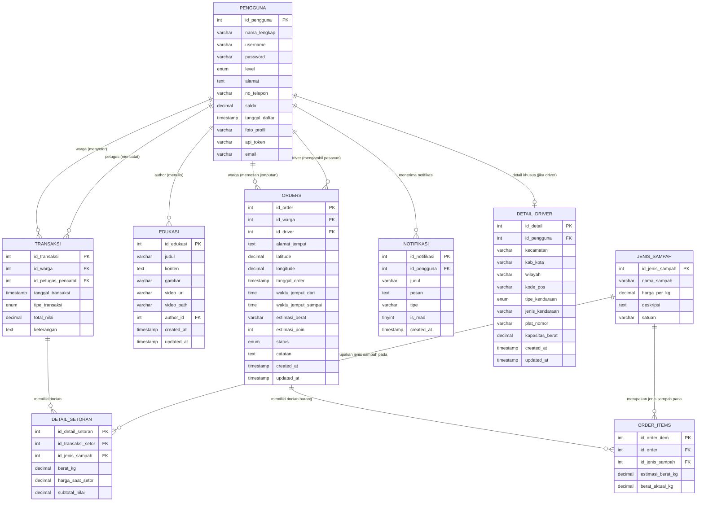

# Entity Relationship Diagram (ERD) - Bank Sampah

Berikut adalah diagram relasi entitas (ERD) dari struktur database aplikasi *Bank Sampah* (berdasarkan file-file SQL di dalam folder `bank_sampah`).

